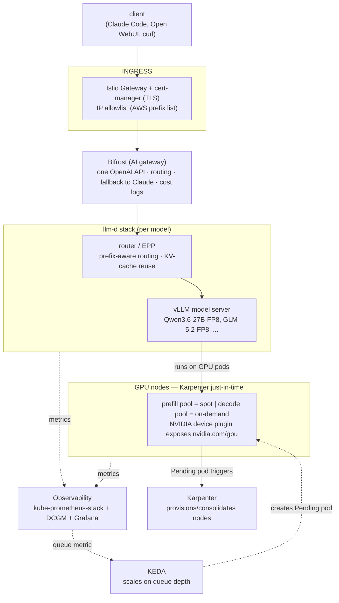

# In-house LLM Inference on Kubernetes — Learning Repo

A hands-on breakdown of the blog [In-house LLM Inference on Kubernetes: A Production Runbook](https://gd03.me/writings/inference-infra) by GD03Champ (repo: [gd03champ/inference-infra](https://github.com/gd03champ/inference-infra)).

The original post is a dense, single-page runbook. This repo turns it into:

1. A clean, **readable** version of the article — [`docs/blog.md`](docs/blog.md)
2. **Small concept modules** you can learn one at a time — [`docs/modules/`](docs/modules/)
3. **Hands-on labs** you can actually run (locally, no AWS bill) — [`docs/labs/`](docs/labs/)
4. **Alternative-stack deep dives** to learn by swapping pieces — [`docs/alternatives/`](docs/alternatives/)
   - Replace Bifrost with **Envoy AI Gateway**
   - Explore the **Bifrost** UI/gateway itself
   - Add **HAMi** GPU sharing (fractional GPUs — the thing the blog says is impossible with the vanilla device plugin)

---

## The stack in one picture

_Autoscaling: KEDA (queue depth) → Pending pod → Karpenter (new node), and the reverse when idle._

---

## Suggested learning path

Work top to bottom. Each module is short; each lab is runnable.

| # | Read | Then do |
|---|------|---------|
| 0 | [`docs/blog.md`](docs/blog.md) — the whole story, readable | — |
| 1 | [`modules/01-gpus-in-k8s.md`](docs/modules/01-gpus-in-k8s.md) | [`labs/lab-00-local-cluster.md`](docs/labs/lab-00-local-cluster.md) |
| 2 | [`modules/02-karpenter-gpu-nodes.md`](docs/modules/02-karpenter-gpu-nodes.md) | [`labs/lab-01-vllm-single-gpu.md`](docs/labs/lab-01-vllm-single-gpu.md) |
| 3 | [`modules/03-ingress-tls.md`](docs/modules/03-ingress-tls.md) | — |
| 4 | [`modules/04-observability.md`](docs/modules/04-observability.md) | (Prometheus/Grafana in lab-01) |
| 5 | [`modules/05-serving-llm-d.md`](docs/modules/05-serving-llm-d.md) | [`labs/lab-01-vllm-single-gpu.md`](docs/labs/lab-01-vllm-single-gpu.md) |
| 6 | [`modules/06-scaling-keda.md`](docs/modules/06-scaling-keda.md) | [`labs/lab-05-keda-autoscale.md`](docs/labs/lab-05-keda-autoscale.md) |
| 7 | [`modules/07-economics.md`](docs/modules/07-economics.md) | — |
| 8 | [`alternatives/hami-gpu-sharing.md`](docs/alternatives/hami-gpu-sharing.md) | [`labs/lab-02-hami-gpu-sharing.md`](docs/labs/lab-02-hami-gpu-sharing.md) |
| 9 | [`alternatives/envoy-ai-gateway.md`](docs/alternatives/envoy-ai-gateway.md) | [`labs/lab-03-envoy-ai-gateway.md`](docs/labs/lab-03-envoy-ai-gateway.md) |
| 10 | [`alternatives/bifrost.md`](docs/alternatives/bifrost.md) | [`labs/lab-04-bifrost.md`](docs/labs/lab-04-bifrost.md) |

---

## Two ways to run the labs

You do **not** need to burn money on an H200 to learn this. Two tracks:

- **Track A — Local (free).** `kind` or `minikube`. Learn Kubernetes, Gateway API, KEDA, Bifrost, Envoy AI Gateway, and (if you have any NVIDIA GPU) HAMi + a small vLLM model. This is where you should start. See [`labs/lab-00-local-cluster.md`](docs/labs/lab-00-local-cluster.md).
- **Track B — AWS (real cost).** Reproduce the blog on EKS with Karpenter and real GPU instances. Only do this once Track A makes sense. Cost-control notes are in each module.

> Model names in the blog (`glm-5.2`, `qwen-3.6`, `sonnet-5`) are the author's near-future naming. In the labs we substitute small, really-downloadable models (e.g. `Qwen/Qwen2.5-0.5B-Instruct`, `facebook/opt-125m`) so you can actually run them.

---

## Prerequisites checklist

- `kubectl`, `helm` (v3.12+), `git`, `curl`
- Docker (for `kind`) **or** `minikube`
- For real GPU labs: an NVIDIA GPU + driver, or an AWS account with a GPU service quota
- Optional but recommended: a [Hugging Face](https://huggingface.co/settings/tokens) token for gated models

See [`docs/labs/lab-00-local-cluster.md`](docs/labs/lab-00-local-cluster.md) to get a cluster up in ~5 minutes.
