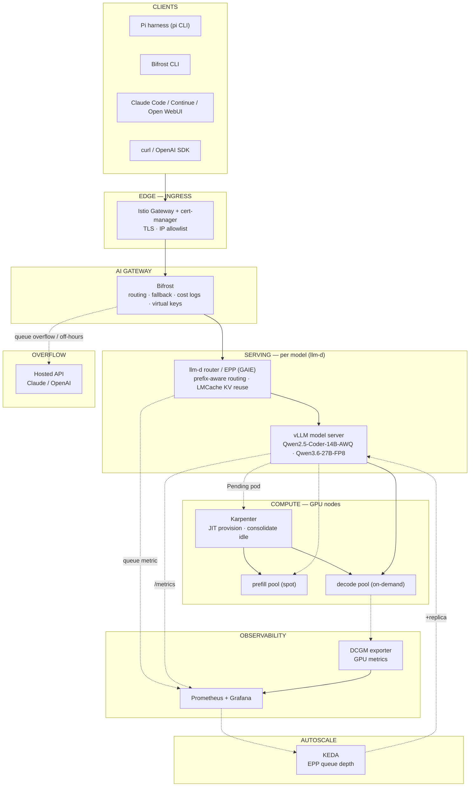
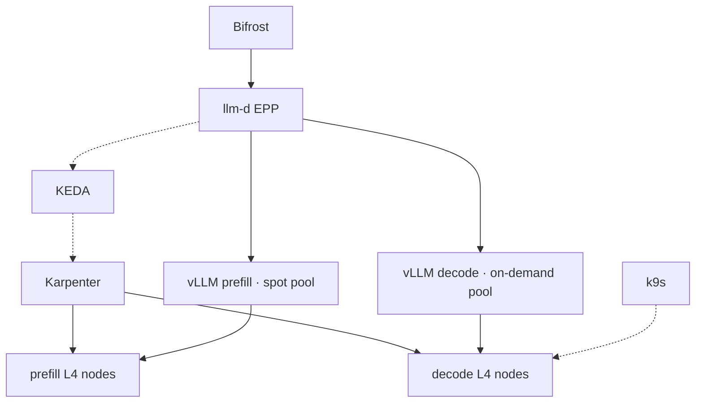
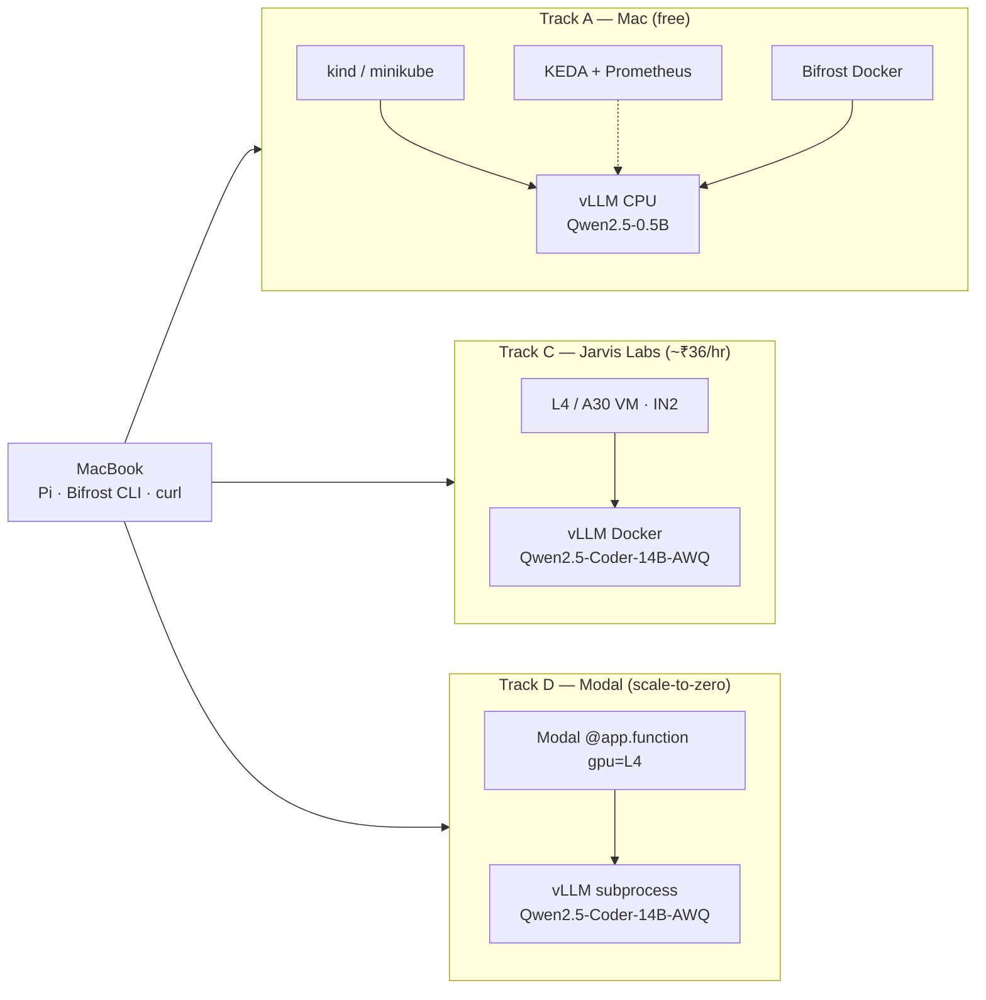
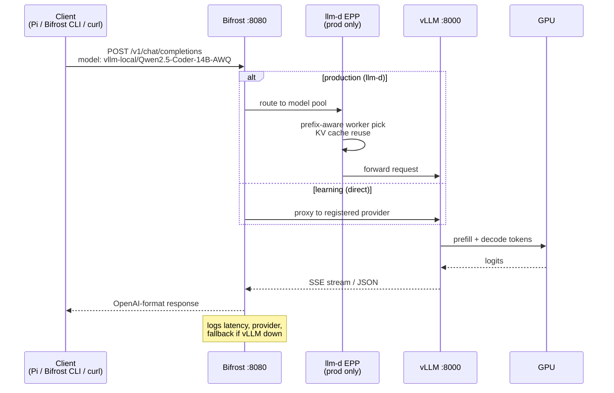
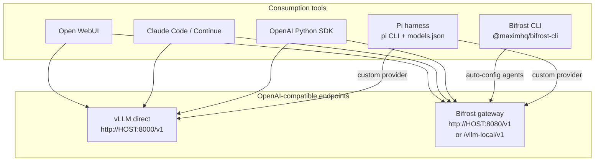
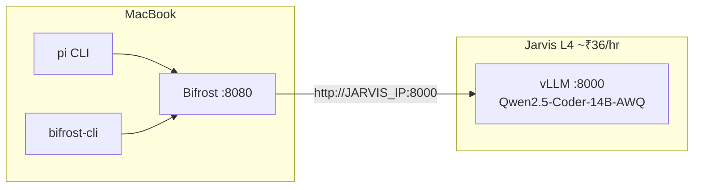

# Architecture — full inference stack & client consumption

How the production stack fits together, the learning-track variants, and how to consume it with **Pi harness**, **Bifrost CLI**, or any OpenAI-compatible client.

---

## 1. Production stack (blog / Track B — AWS EKS)

The target architecture from [`blog.md`](blog.md): multi-user, autoscaling, one hardened gateway.



---

## 2b. Multi-GPU + Karpenter (Track F — production target)

Prefill (spot) + decode (on-demand), KEDA → Pending → Karpenter, llm-d EPP. Full doc: [`multi-gpu-karpenter-stack.md`](multi-gpu-karpenter-stack.md).



**Karpenter requires EKS (AWS EC2).** Jarvis multi-VM uses the same taints/pools manually until you move to EKS.

## 2c. Single L4 homelab (Track E — starter)

[`homelab-production-stack.md`](homelab-production-stack.md) — kind + k9s, one GPU, decode only.

---

## 3. Learning stacks (Tracks A / C / D)

Same **OpenAI API contract** at every layer; fewer moving parts while you learn.



| Track | GPU | Model (quantized) | Gateway | K8s autoscale |
|-------|-----|-----------------|---------|---------------|
| A | CPU (kind) | `Qwen/Qwen2.5-0.5B-Instruct` | Bifrost local | KEDA ✅ |
| C | Jarvis L4 24 GB | `Qwen/Qwen2.5-Coder-14B-Instruct-AWQ` | Bifrost on Mac | manual pause |
| D | Modal L4 24 GB | `Qwen/Qwen2.5-Coder-14B-Instruct-AWQ` | Bifrost on Mac | Modal autoscale |
| B | EKS g5/g6 | blog models | Bifrost in cluster | KEDA + Karpenter ✅ |

---

## 3. Request flow (one chat completion)



**Direct to vLLM (no gateway):** skip Bifrost — client → `http://<host>:8000/v1/chat/completions`.

---

## 4. Autoscaling chain (production)

```mermaid
flowchart LR
    load["Traffic ↑"] --> q["EPP queue depth ↑"]
    q --> keda["KEDA +1 replica"]
    keda --> pend["Pending vLLM pod"]
    pend --> karp["Karpenter<br/>new GPU node"]
    karp --> run["Pod Running<br/>queue drains"]
    run --> idle["Traffic ↓"]
    idle --> keda2["KEDA -1 replica"]
    keda2 --> empty["Node empty"]
    empty --> karp2["Karpenter consolidate<br/>~1 min"]
    karp2 --> bill["Bill stops"]
```



Local equivalent: [Lab 05](labs/lab-05-keda-autoscale.md) uses `vllm:num_requests_waiting` instead of EPP queue size.

---

## 5. How clients consume the stack



**Recommendation:** use **Bifrost** in front for fallback + logging; point **Pi** at Bifrost so one config covers self-hosted + Claude overflow.

---

## 6. Pi harness — setup

[Pi](https://github.com/earendil-works/pi) (`@earendil-works/pi-coding-agent`) is a minimal coding agent CLI. It talks to any OpenAI-compatible API via `~/.pi/agent/models.json`.

### Install

```bash
npm install -g @earendil-works/pi-coding-agent
```

### Option A — direct to vLLM (Jarvis / Modal / local)

Create `~/.pi/agent/models.json`:

```json
{
  "providers": {
    "vllm-jarvis": {
      "baseUrl": "http://<JARVIS_IP>:8000/v1",
      "api": "openai-completions",
      "apiKey": "none",
      "compat": {
        "supportsDeveloperRole": false,
        "supportsReasoningEffort": false
      },
      "models": [
        {
          "id": "Qwen2.5-Coder-14B-AWQ",
          "name": "Qwen2.5 Coder 14B AWQ",
          "contextWindow": 32768,
          "maxTokens": 8192
        }
      ]
    }
  }
}
```

Modal URL example: `"baseUrl": "https://your-workspace--llm-lab-coder-serve.modal.run/v1"`

Run:

```bash
pi --model vllm-jarvis/Qwen2.5-Coder-14B-AWQ
# or inside TUI: /model
```

Verify models load:

```bash
pi --list-models vllm-jarvis
```

### Option B — through Bifrost (fallback + one URL)

Point Pi at Bifrost instead of vLLM directly:

```json
{
  "providers": {
    "bifrost": {
      "baseUrl": "http://localhost:8080/v1",
      "api": "openai-completions",
      "apiKey": "none",
      "compat": {
        "supportsDeveloperRole": false,
        "supportsReasoningEffort": false
      },
      "models": [
        { "id": "vllm-local/Qwen2.5-Coder-14B-AWQ" }
      ]
    }
  }
}
```

Model `id` must match what Bifrost exposes — check `curl http://localhost:8080/v1/models`.

---

## 7. Bifrost CLI — setup

Bifrost CLI wires coding agents to your gateway without hand-editing env vars.

### Start the gateway

```bash
# gateway (pick one)
docker run --rm -p 8080:8080 -v "$(pwd)/bifrost-data:/app/data" maximhq/bifrost
# or: npx -y @maximhq/bifrost
```

Register vLLM ([Lab 04](labs/lab-04-bifrost.md)):

```bash
curl http://localhost:8080/api/providers \
  -H 'Content-Type: application/json' \
  -d '{
    "provider": "vllm-local",
    "keys": [{"name":"k1","value":"dummy","models":["*"],"weight":1.0}],
    "network_config": {"base_url":"http://host.docker.internal:8000","default_request_timeout_in_seconds":120},
    "custom_provider_config": {"base_provider_type":"openai","allowed_requests":{"chat_completion":true,"chat_completion_stream":true}}
  }'
```

### Launch Bifrost CLI

```bash
npx -y @maximhq/bifrost-cli
```

Interactive steps:

1. **Base URL** → `http://localhost:8080`
2. **Agent** → Pi / Claude Code / Codex / OpenCode (CLI fetches models from `/v1/models`)
3. **Model** → `vllm-local/Qwen2.5-Coder-14B-AWQ`

CLI sets `OPENAI_BASE_URL`, API key, and model for the agent automatically.

### curl through Bifrost (no CLI)

```bash
curl http://localhost:8080/v1/chat/completions \
  -H 'Content-Type: application/json' \
  -d '{
    "model": "vllm-local/Qwen2.5-Coder-14B-AWQ",
    "messages": [{"role":"user","content":"Write a KEDA ScaledObject for vLLM queue depth."}]
  }'
```

With hosted fallback when vLLM is down:

```bash
curl http://localhost:8080/v1/chat/completions \
  -H 'Content-Type: application/json' \
  -d '{
    "model": "vllm-local/Qwen2.5-Coder-14B-AWQ",
    "messages": [{"role":"user","content":"Hello"}],
    "fallbacks": ["anthropic/claude-sonnet-4-20250514"]
  }'
```

---

## 8. End-to-end: Mac + Jarvis + Bifrost + Pi



**Boot order:**

1. Jarvis: start vLLM ([Lab 07](labs/lab-07-jarvislabs-gpu.md))
2. Mac: `docker run ... maximhq/bifrost` + register Jarvis IP as provider
3. Mac: `pi --model bifrost/vllm-local/Qwen2.5-Coder-14B-AWQ` **or** `npx -y @maximhq/bifrost-cli`

---

## 9. Model reference (labs)

| Hugging Face ID | Quant | VRAM | Used in |
|-----------------|-------|------|---------|
| `Qwen/Qwen2.5-Coder-14B-Instruct-AWQ` | AWQ 4-bit | ~9 GB + KV | Lab 07, 08 (primary) |
| `Qwen/Qwen2.5-Coder-32B-Instruct-AWQ` | AWQ 4-bit | ~18 GB + KV | Lab 07 stretch |
| `Qwen/Qwen2.5-Coder-7B-Instruct-AWQ` | AWQ 4-bit | ~5 GB | Lab 07 fallback |
| `Qwen/Qwen2.5-0.5B-Instruct` | FP16 | CPU | Lab 01, 05 |

vLLM serve name (for clients): `--served-model-name Qwen2.5-Coder-14B-AWQ`

---

## Related docs

| Doc | Topic |
|-----|-------|
| [Lab 04 — Bifrost](labs/lab-04-bifrost.md) | Gateway UI + provider registration |
| [Lab 07 — Jarvis](labs/lab-07-jarvislabs-gpu.md) | GPU VM + vLLM Docker |
| [Lab 08 — Modal](labs/lab-08-modal-serverless.md) | Serverless vLLM |
| [Lab 05 — KEDA](labs/lab-05-keda-autoscale.md) | Autoscale on queue depth |
| [blog.md](blog.md) | Full production runbook |
