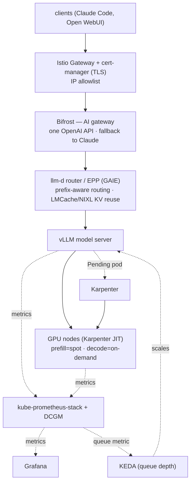
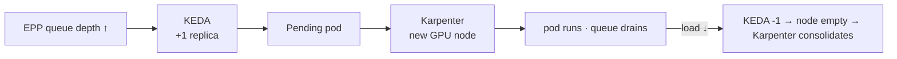

# In-house LLM Inference on Kubernetes: A Production Runbook

> A cleaned-up, readable version of [gd03.me/writings/inference-infra](https://gd03.me/writings/inference-infra) by GD03Champ.
> Manifests referenced live in [gd03champ/inference-infra](https://github.com/gd03champ/inference-infra).
> Typos fixed and layout normalized for readability. Technical content preserved.

Most "self-host an LLM / llm-d" guides either stop at `docker run vllm/vllm-openai` on a single GPU, or only talk theory about llm-d. This is the other side: a runbook written while setting up open-weight coding models as a **production** inference stack on Kubernetes.

The goal: GPUs that appear and vanish on demand, models served under real frameworks, autoscaling driven by **queue depth** (not CPU%), a single hardened gateway in front, full observability, and a fallback so no user ever hits a wall. It's copied more or less straight from build notes — warts and all: the OOM, the `Pending` pod that never scheduled, and everything in between.

Three threads run through it:

1. **Managing GPUs in Kubernetes.** They're expensive, discrete, and awkward in ways CPU nodes never are. Getting this right is most of the work.
2. **Serving models the production way.** vLLM under llm-d v0.8.1, deployed via guides, behind one OpenAI-compatible gateway.
3. **Scaling it, and the economics.** Where in-house inference stops being a POC and becomes something you can defend on a spreadsheet.

---

## The inference stack

The cast, and why each one is here:

- **vLLM** — the inference serving engine.
- **KEDA** — like HPA, but scales on real-time events (here a vLLM/EPP metric), not CPU%.
- **GAIE** — the Gateway API Inference Extension.
- **llm-d** — the router plus model server. Integrates **LMCache** as a pluggable KV-cache manager; LMCache uses NVIDIA's **NIXL** to offload/move caches over the best route (on AWS that's **EFA**).
- **Karpenter** — provisions and consolidates nodes.
- **Istio + cert-manager** — TLS ingress.
- **Bifrost** — the AI gateway.
- **kube-prometheus-stack + DCGM** — observability.
- **Open WebUI** — a test UI.

The whole architecture on one page:



### The plan, before any of this

Target: Claude Code–compatible coding on an open model (`glm-5.2-fp8`, roughly on par with `sonnet-5`). Back-of-envelope:

- A single `p5e.48xlarge` holds ~30 concurrent users at a 128k context window.
- Shut GPU nodes down at night; fall back to Claude for stragglers.
- Roll out to a selected pool of users. On queue overfill (say 30 deep), overflow falls back to Claude too.
- In Portkey/Bifrost, set the self-hosted cost equal to `sonnet-5`, then compute real savings as the cluster cost delta.
- Squeeze more concurrency later with llm-d disaggregation.

Deployment plan: start with a single llm-d inference pool, then disaggregate.

### Cluster config

EKS with these addons: CoreDNS, kube-proxy, Prometheus Node Exporter, Amazon VPC CNI, External DNS, Amazon EKS Pod Identity Agent, Node monitoring agent, Metrics Server. **Pod Identity** is the one to note — it's how every IAM binding below is wired, no long-lived keys anywhere.

```bash
export CLUSTER_NAME="genai-systems"
export AWS_REGION="ap-south-1"
```

---

## 1. Karpenter and GPU nodes

The single most expensive mistake in this whole stack is an **idle GPU node**. A `g6e.16xlarge` is not something you leave running "just in case." So nodes have to be genuinely just-in-time. Karpenter is how.

### IAM role for the Karpenter controller

Pod Identity trust policy, then create the role:

```json
{
  "Version": "2012-10-17",
  "Statement": [{
    "Effect": "Allow",
    "Principal": {"Service": "pods.eks.amazonaws.com"},
    "Action": ["sts:AssumeRole", "sts:TagSession"]
  }]
}
```

```bash
aws iam create-role \
  --role-name KarpenterControllerRole-${CLUSTER_NAME} \
  --assume-role-policy-document file://karpenter-controller-trust-policy.json
```

### Bind the role to the ServiceAccount via Pod Identity

```bash
aws eks create-pod-identity-association \
  --cluster-name $CLUSTER_NAME \
  --namespace kube-system \
  --service-account karpenter \
  --role-arn arn:aws:iam::$AWS_ACCOUNT_ID:role/KarpenterControllerRole-$CLUSTER_NAME
```

### CloudFormation stack for Karpenter's runtime resources

Creates the node IAM role/policies, the SQS InterruptionQueue, and EventBridge rules that watch EC2 node status:

```bash
curl -fsSL https://raw.githubusercontent.com/aws/karpenter-provider-aws/v${KARPENTER_VERSION}/website/content/en/preview/getting-started/getting-started-with-karpenter/cloudformation.yaml -o karpenter-cf.yaml

aws cloudformation deploy \
  --stack-name "Karpenter-$CLUSTER_NAME" \
  --template-file karpenter-cf.yaml \
  --capabilities CAPABILITY_NAMED_IAM \
  --parameter-overrides "ClusterName=$CLUSTER_NAME"
```

### Install Karpenter via Helm

Karpenter needs some compute to run on before it can create any nodes, and it shouldn't run on the nodes it manages. Bootstrap it on a 2-node managed nodegroup; add affinities/taints to fully isolate it later.

```bash
helm upgrade --install karpenter oci://public.ecr.aws/karpenter/karpenter \
  --version "$KARPENTER_VERSION" \
  --namespace kube-system \
  --set settings.clusterName=$CLUSTER_NAME \
  --set settings.interruptionQueue=$CLUSTER_NAME \
  --set controller.resources.requests.cpu=1 \
  --set controller.resources.requests.memory=1Gi \
  --wait
```

### Tag subnets (and a security group) for discovery

Karpenter finds subnets and SGs by the `karpenter.sh/discovery` tag. One subnet per AZ so it has choice, and at least one SG.

```bash
aws ec2 create-tags --resources subnet-0c863ec7206e5ff8b \
  --tags Key=karpenter.sh/discovery,Value=$CLUSTER_NAME
# ...one per AZ...
```

### The NodePools, where the models live

Two rules baked into the GPU pools:

- **Consolidation is `1m`** — idle GPUs die quickly, to save cost fast.
- **Prefill gets spot, decode gets on-demand.** Spot saves 60–70%. A killed prefill worker just retries and can tolerate the ~2-minute spot callback. A killed decode worker cuts off a user mid-generation, which it cannot.

```yaml
# Prefill pool - GPU, spot-tolerant (a killed prefill worker just retries)
apiVersion: karpenter.sh/v1
kind: NodePool
metadata: {name: prefill}
spec:
  template:
    metadata:
      labels: {llm-d.ai/role: prefill}
    spec:
      requirements:
        - {key: node.kubernetes.io/instance-type, operator: In, values: ["g5.xlarge","g5.2xlarge","g6.xlarge","g6.2xlarge"]}
        - {key: karpenter.sh/capacity-type, operator: In, values: ["spot","on-demand"]}
      nodeClassRef: {group: karpenter.k8s.aws, kind: EC2NodeClass, name: gpu}
      taints:
        - {key: llm-d.ai/role, value: prefill, effect: NoSchedule}
  disruption: {consolidationPolicy: WhenEmptyOrUnderutilized, consolidateAfter: 1m}
  limits: {cpu: 64, memory: 256Gi, nvidia.com/gpu: 8}
---
# Decode pool - GPU, on-demand only (mid-generation kills are user-visible)
apiVersion: karpenter.sh/v1
kind: NodePool
metadata: {name: decode}
spec:
  template:
    metadata:
      labels: {llm-d.ai/role: decode}
    spec:
      requirements:
        - {key: node.kubernetes.io/instance-type, operator: In, values: ["g5.xlarge","g5.2xlarge","g6.xlarge","g6.2xlarge"]}
        - {key: karpenter.sh/capacity-type, operator: In, values: ["on-demand"]}
      nodeClassRef: {group: karpenter.k8s.aws, kind: EC2NodeClass, name: gpu}
      taints:
        - {key: llm-d.ai/role, value: decode, effect: NoSchedule}
  disruption: {consolidationPolicy: WhenEmptyOrUnderutilized, consolidateAfter: 1m}
  limits: {cpu: 64, memory: 256Gi, nvidia.com/gpu: 8}
```

### The NVIDIA device plugin (the step that trips people)

The AMI has drivers, but `nvidia.com/gpu` won't show up as a schedulable resource until this DaemonSet runs — and it must tolerate the GPU taint to land on the tainted nodes:

```bash
helm repo add nvdp https://nvidia.github.io/k8s-device-plugin
helm upgrade --install nvdp nvdp/nvidia-device-plugin \
  --namespace kube-system \
  --set tolerations[0].key=llm-d.ai/role \
  --set tolerations[0].operator=Exists \
  --set tolerations[0].effect=NoSchedule
```

### Smoke test: does the whole chain work?

Run a CUDA container pinned to the `decode` selector. Karpenter should spin up a GPU node, the scheduler should place the pod, and `nvidia-smi` should return GPU data from inside the pod:

```yaml
apiVersion: v1
kind: Pod
metadata: {name: cuda-test}
spec:
  tolerations:
    - {key: llm-d.ai/role, operator: Exists, effect: NoSchedule}
  nodeSelector: {llm-d.ai/role: decode}
  containers:
    - name: cuda-check
      image: nvidia/cuda:12.4.0-base-ubuntu22.04
      command: ["nvidia-smi"]
  restartPolicy: Never
```

Delete the pod and the node gets consolidated away (`consolidateAfter: 1m`). The whole GPU lifecycle in one test.

---

## 2. What you actually need to understand about GPUs in Kubernetes

This is the physics the scheduler works on:

- `g5`/`g6` use NVIDIA A10G/L4, each with **24 GB VRAM**. One `nvidia.com/gpu` = the whole 24 GB.
- A node can have multiple GPUs (`g5.12xlarge` = 4× A10G, `g5.48xlarge` = 8× A10G). Only then does **tensor parallelism (TP)** activate, for models that don't fit in 24 GB.
- AWS has fractional-GPU instances (g6f family), but a model still has to load fully within a single node.
- To split a model **across nodes** you need **pipeline parallelism (PP)** — layers split across GPU nodes via Ray in vLLM. This is how 500B+ models get served.
- When a pod gets 1 GPU, it **fully takes over** that GPU. Another pod can't share it — that's what `nvidia-device-plugin` enforces. Fractional allocation is not possible; it's strongly discrete.

> That last point is exactly what **HAMi** changes — see [`alternatives/hami-gpu-sharing.md`](../alternatives/hami-gpu-sharing.md).

---

## 3. Ingress and TLS with Istio + cert-manager

### Gateway API CRDs (Istio needs them)

```bash
kubectl apply -f https://github.com/kubernetes-sigs/gateway-api/releases/download/v1.3.0/standard-install.yaml
```

### cert-manager, for TLS

```bash
helm repo add jetstack https://charts.jetstack.io
helm upgrade --install cert-manager jetstack/cert-manager \
  --namespace cert-manager --create-namespace \
  --set crds.enabled=true --wait
```

### Istio: base + istiod (no separate ingress workload)

The `Gateway` resource itself makes Istio stand up the proxy.

```bash
kubectl create namespace istio-system
helm repo add istio https://istio-release.storage.googleapis.com/charts
helm upgrade --install istio-base istio/base -n istio-system --set defaultRevision=default --wait
helm upgrade --install istiod istio/istiod -n istio-system --wait
```

### AWS Load Balancer Controller

Same Pod Identity pattern: policy, role, association, then the chart. (See the original for the full command block.)

### Teach cert-manager the Gateway API, then set the issuer

```bash
helm upgrade cert-manager jetstack/cert-manager \
  --namespace cert-manager --reuse-values \
  --set config.apiVersion=controller.config.cert-manager.io/v1alpha1 \
  --set config.kind=ControllerConfiguration \
  --set config.enableGatewayAPI=true \
  --wait
```

Then a `ClusterIssuer` (HTTP-01 via the Gateway):

```yaml
apiVersion: cert-manager.io/v1
kind: ClusterIssuer
metadata: {name: letsencrypt-http01}
spec:
  acme:
    server: https://acme-v02.api.letsencrypt.org/directory
    email: you@example.com
    privateKeySecretRef: {name: letsencrypt-http01-key}
    solvers:
      - http01:
          gatewayHTTPRoute:
            parentRefs:
              - {name: cluster-gateway, namespace: istio-system, kind: Gateway}
```

### The Gateway

- GatewayClass `istio` (installed with Istio).
- HTTP-01 cert validation (cert-manager auto-adds the challenge). DNS-01 is also possible via an ACM cert.
- An AWS prefix list IP-whitelists the internet-facing ingress LB.

> Certs can bounce a few times before they take. Deleting a stuck cert restarts the ACME flow.

Then routes point at real backends:

```yaml
apiVersion: gateway.networking.k8s.io/v1
kind: HTTPRoute
metadata: {name: grafana, namespace: monitoring}
spec:
  parentRefs:
    - {name: cluster-gateway, namespace: istio-system, sectionName: https-grafana}
  hostnames: ["watchme.example.com"]
  rules:
    - backendRefs: [{name: kube-prometheus-stack-grafana, port: 80}]
```

---

## 4. Observability, wired before we need it

Three sources, one Prometheus, all in Grafana.

### EBS CSI driver (so kube-prometheus-stack can use PVCs)

Standard Pod Identity role + the `aws-ebs-csi-driver` addon.

### kube-prometheus-stack

Node exporters off (the EKS addon covers them); Prometheus and Grafana on gp3 PVCs:

```yaml
prometheus-node-exporter: {enabled: false}
nodeExporter: {enabled: false}
prometheus:
  prometheusSpec:
    storageSpec:
      volumeClaimTemplate:
        spec:
          storageClassName: gp3
          resources: {requests: {storage: 20Gi}}
grafana:
  persistence: {enabled: true, storageClassName: gp3, size: 5Gi}
```

### DCGM exporter (GPU metrics)

Only on GPU nodes, tolerating the taint:

```yaml
nodeSelector: {nvidia.com/gpu.present: "true"}
tolerations:
  - {key: llm-d.ai/role, operator: Exists, effect: NoSchedule}
serviceMonitor:
  enabled: true
  honorLabels: true
  namespace: monitoring
  additionalLabels: {release: kube-prometheus-stack}
```

> **The catch that eats an afternoon:** every ServiceMonitor and PodMonitor needs `release: kube-prometheus-stack` in its labels, or this Prometheus won't select it. No error, no data.

---

## 5. Serving models with llm-d

### Bifrost, the front door

The AI gateway. Bifrost fronts all model routing so clients speak one OpenAI-compatible API and never touch a model service directly:

```bash
kubectl create ns bifrost
kubectl create secret generic bifrost-encryption-key \
  --from-literal=encryption-key="$(openssl rand -base64 32)" -n bifrost

helm install bifrost bifrost/bifrost \
  --set image.tag=v1.4.11 \
  --set bifrost.encryptionKeySecret.name="bifrost-encryption-key" \
  --set bifrost.encryptionKeySecret.key="encryption-key" \
  -n bifrost
```

Once models are registered, every request flows through here, and Bifrost's dashboard is the single pane for who's calling what, latencies, and fallback hits.

### Understanding llm-d (v0.8.1)

llm-d infra is set up **distinct** from model deployments; each model has its own stack:

- a **model server** (kustomize)
- a **router** (helm)
- a **gateway** (skipped here — everything routes via Bifrost)

Each component has a base + scenario-specific overrides via kustomize, from the main repo's `guides/`. This uses the `optimized-baseline` guide. Its baseline is **prefix-aware routing**: requests sharing a prefix land on the same worker and reuse its KV cache. For agentic work — where the same giant system prompt prefixes every call — this is enormous.

### The dream deployment: GLM-5.2 on H200

`glm-5.2-fp8` needs ~750 GB VRAM → 8× H200 (8 × 141 = 1128 GB). Two P5 options; only `p5en.48xlarge` (v3 EFA, ~33% lower inter-node latency) is available in `ap-south-1`.

NodePool for the H200:

```yaml
apiVersion: karpenter.sh/v1
kind: NodePool
metadata: {name: baseline-glm52}
spec:
  template:
    metadata:
      labels: {llm-d.ai/role: baseline-glm52, nvidia.com/gpu.present: "true"}
    spec:
      requirements:
        - {key: node.kubernetes.io/instance-type, operator: In, values: ["p5en.48xlarge"]}
        - {key: karpenter.sh/capacity-type, operator: In, values: ["on-demand"]}
      nodeClassRef: {group: karpenter.k8s.aws, kind: EC2NodeClass, name: gpu-h200}
      taints:
        - {key: llm-d.ai/role, value: baseline-glm52, effect: NoSchedule}
  disruption: {consolidationPolicy: WhenEmptyOrUnderutilized, consolidateAfter: 5m}
  limits: {cpu: 192, memory: 2048Gi, nvidia.com/gpu: 8}
```

> **Node selector matters:** nodeclasses are reusable, but each model gets its own nodepool. The pod's node selector finds the right one. A missing selector means vLLM pods land on unintended GPU nodepools. Taints + tolerations + node selector = exclusive model-to-instance affinity.

GAIE CRDs:

```bash
kubectl apply -f https://github.com/kubernetes-sigs/gateway-api-inference-extension/releases/download/1.5.0/v1-manifests.yaml
```

The kustomize patch is where the model gets configured (TP=8 across eight H200s):

```yaml
# patch-vllm.yaml (abridged)
containers:
  - name: modelserver
    command: ["vllm", "serve"]
    args:
      - "zai-org/GLM-5.2-FP8"
      - "--tensor-parallel-size=8"
      - "--kv-cache-dtype=fp8_e4m3"
      - "--gpu-memory-utilization=0.80"
      - "--tool-call-parser=glm47"
      - "--reasoning-parser=glm45"
      - "--enable-auto-tool-choice"
      - "--max-num-seqs=32"
    resources:
      limits: {cpu: '64', memory: 900Gi, nvidia.com/gpu: 8}
```

Install router (helm) + model server (kustomize):

```bash
helm install $GUIDE_NAME $ROUTER_STANDALONE_CHART \
  -f $REPO_ROOT/guides/recipes/router/base.values.yaml \
  -f $REPO_ROOT/guides/$GUIDE_NAME/router/$GUIDE_NAME.values.yaml \
  -n $NAMESPACE --version $ROUTER_CHART_VERSION

kubectl apply -n $NAMESPACE -k $REPO_ROOT/guides/optimized-baseline/modelserver/gpu/vllm/glm-5.2/
```

### ...not so soon

The pod stays `Pending` forever — `p5en.48xlarge` simply isn't available in the region, and reservations don't come through. Honest reflection: **a frontier model can't be run by a single person even with the funds**, because HBM cards from hyperscalers are rented months ahead by big tech. The GLM-5.2 nodepool and overlay stay in the repo, ready for when capacity frees up.

### Plan B: Qwen3.6-27B on L40S, same pattern

Deploy `qwen-3.6-27B-fp8` on a `g6e.16xlarge` (L40S, 44 GB VRAM) under llm-d — same steps, model-agnostic platform.

```bash
kubectl create ns infra-qwen36
kubectl create secret generic llm-d-hf-token \
  --from-literal=HF_TOKEN="hf_xxxx" -n infra-qwen36

helm install optimized-baseline-qwen36 \
  oci://ghcr.io/llm-d/charts/llm-d-router-standalone \
  -f .../guides/recipes/router/base.values.yaml \
  -f .../guides/optimized-baseline/router/optimized-baseline.values.yaml \
  -n infra-qwen36 --version v0.9.0
```

### The OOM, and the benchmark grind

Applied raw, the pod OOM-crashed immediately — a 27B model consumed all 44 GB because of KV-cache headroom and the default `--max-num-seqs=256`. In production you set `--max-model-len` and `--max-num-seqs` explicitly by benchmarking. Adding MTP (multi-token prediction / speculative decoding) costs more memory, so `--max-num-seqs` has to come down further.

Benchmark grid at 128k context:

| Config | `max-num-seqs` | Result |
| --- | --- | --- |
| no MTP | up to 160 | 18.9 tok/s |
| MTP=2 | 16 (breaks at 160) | 23.4 tok/s |
| MTP=3 | 16 | 43.8 tok/s (+135%) |
| MTP=3 | 32 | 48.6 tok/s ✅ |
| MTP=3 | 40 / 50 | OOM crash ❌ |

Method: set a comfortable MTP first, then raise `max-num-seqs` until it crashes, and back off one step. Final config (~2.5× naive throughput):

```yaml
command: ["vllm", "serve"]
args:
  - "Qwen/Qwen3.6-27B-FP8"
  - "--gpu-memory-utilization=0.95"
  - "--tensor-parallel-size=1"
  - "--max-model-len=128192"
  - "--reasoning-parser=qwen3"
  - "--enable-auto-tool-choice"
  - "--tool-call-parser=qwen3_coder"
  - "--speculative-config"
  - '{"method":"qwen3_next_mtp","num_speculative_tokens":3}'
  - "--max-num-seqs=32"
```

The model is live on the EPP (router pod) service:

```
http://optimized-baseline-qwen36-epp.infra-qwen36.svc.cluster.local:80/v1
```

Register that in Bifrost and it's a routable production model.

### llm-d observability

vLLM pods get PodMonitors from the kustomize `monitoring` component (again: needs the `release: kube-prometheus-stack` label). For router/EPP monitoring, add to `guides/recipes/router/base.values.yaml`:

```yaml
monitoring:
  interval: "10s"
  prometheus:
    enabled: true
    auth: {enabled: false}
```

Then a custom Grafana dashboard for EPP metrics (queue size, routing, per-pool state) — the exact signal KEDA scales on.

---

## 6. Scaling with KEDA

Scaling GPU workloads on CPU% is nonsense — a vLLM pod pinned at 100% GPU can show trivial CPU. You scale on a **serving signal**.

> Gotcha: if the nodepool is limited to a single node, Karpenter can only ever make one node even when KEDA asks for more. Bump the nodepool limits to fit the max replicas.

```bash
helm repo add kedacore https://kedacore.github.io/charts
helm install keda kedacore/keda --namespace keda --create-namespace --wait
```

The ScaledObject — signal is the EPP pool's average queue size, pulled from Prometheus:

```yaml
apiVersion: keda.sh/v1alpha1
kind: ScaledObject
metadata: {name: qwen36-decode-scaler, namespace: infra-qwen36}
spec:
  scaleTargetRef:
    apiVersion: apps/v1
    kind: Deployment
    name: optimized-baseline-nvidia-gpu-vllm-qwen36-decode
  minReplicaCount: 1
  maxReplicaCount: 4
  pollingInterval: 30
  advanced:
    horizontalPodAutoscalerConfig:
      behavior:
        scaleUp:
          stabilizationWindowSeconds: 600
          policies:
            - {type: Pods, value: 1, periodSeconds: 300}   # +1 pod / 5min (matches startup)
        scaleDown:
          stabilizationWindowSeconds: 600
          policies:
            - {type: Pods, value: 1, periodSeconds: 600}   # -1 pod / 10min
  triggers:
    - type: prometheus
      metricType: Value
      metadata:
        serverAddress: http://kube-prometheus-stack-prometheus.monitoring.svc:9090
        metricName: epp_pool_queue_size
        query: sum(llm_d_epp_average_queue_size{namespace="infra-qwen36"})
        threshold: "5"          # add a pod when avg queue/pod > 5
```

The pace matches reality: +1 pod / 5 min, because a cold vLLM pod takes ~5 min to warm up.

### The two autoscalers, chained

KEDA and Karpenter don't know about each other, but they chain perfectly through the scheduler:



- **KEDA** answers "do I need more replicas?"
- **Karpenter** answers "is there a node for this pod?"
- The **pending pod** is the handoff.

When load drops it runs in reverse, and you stop paying. Nobody touches a thing.

---

## 7. Why do this at all?

### The economics: overflow, off-hours, overall savings

The headline is **concurrency-per-dollar**. One large node holds ~30 concurrent users at 128k context. Once you serve a team, owning hardware wins — but only if you're disciplined about idle cost:

- **Shut GPU nodes down at night**, fall back to Claude. Don't pay while everyone's asleep.
- **On queue overflow (30 deep), spill to the hosted provider** instead of degrading everyone. Size for the common case, not the peak.
- **Price the self-hosted model equal to `sonnet-5`** in the gateway. Every request logs a cost as if it hit Claude; real savings = that number minus the cluster cost delta.
- **Optimized throughput compounds it.** That 2.5× from the MTP grind is 2.5× more users per node.
- **More concurrency from llm-d disaggregation**, the next lever once the pool saturates.

### The things a hosted API can't sell you

- **Sliding-window prompt caching.** Prefix-aware routing + KV-cache reuse (LMCache) computes the giant system prompt once and reuses it. You own the cache policy.
- **Request tiering, including batching.** You decide what's interactive vs. a background batch job.
- **Fine-tuned, uncensored, cyber-focused models.** Run domain-tuned models, or models that won't refuse legitimate security work.
- **Your own in-house models.** Train it, quantize it, serve it. Model-agnostic platform, data never leaves your VPC.

Economics get you in the door. You stay because you own the serving layer end to end: caching, tiering, custom models, data residency, refusal policy.

---

## Where it landed

- **GPUs managed efficiently:** Karpenter just-in-time, spot for prefill, on-demand for decode, aggressive consolidation.
- **A model served the production way:** Qwen3.6-27B-FP8 under llm-d v0.8.1, tuned to 2.5× naive throughput.
- **Autoscaling on realtime signals:** KEDA on EPP queue depth, chained into Karpenter.
- **One hardened front door:** Bifrost behind a TLS, IP-allowlisted Istio gateway, with hosted fallback.
- **Observable end to end:** cluster, GPU, and serving metrics + a custom EPP dashboard.

Artifacts: [gd03champ/inference-infra](https://github.com/gd03champ/inference-infra), manifest by manifest, with a README per component.
