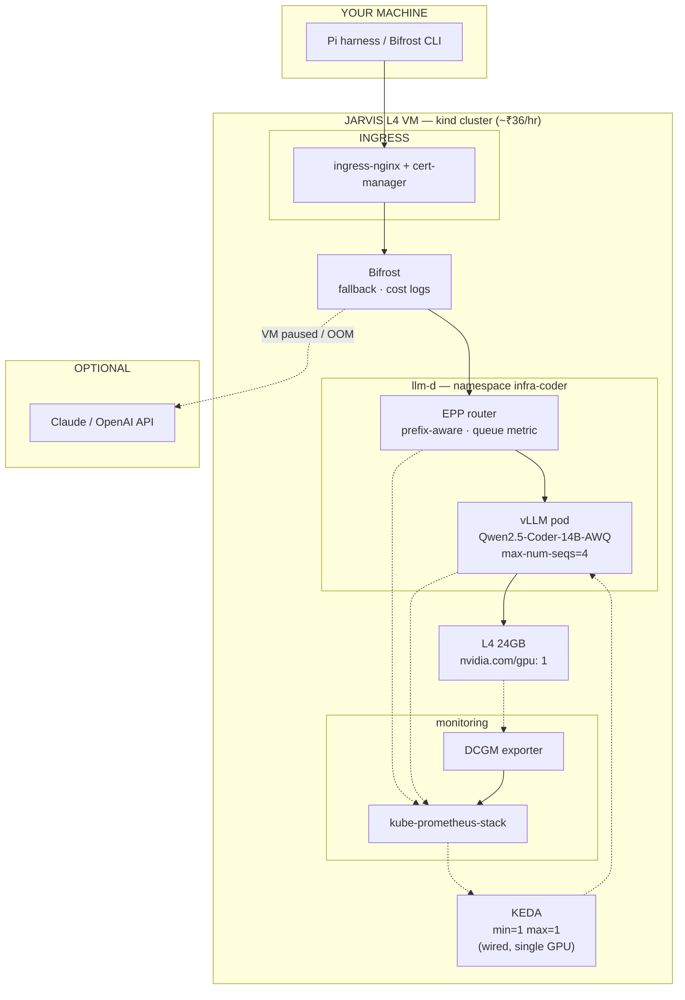

# Homelab production stack — same architecture, L4, self-managed K8s

Run the **same production inference stack** as the blog — llm-d, vLLM, Bifrost, KEDA, Prometheus, DCGM, ingress — on a **single NVIDIA L4 (24 GB)** with a **quantized coding model**. No AWS EKS. No Karpenter. You self-manage Kubernetes on a [Jarvis Labs](https://jarvislabs.ai) VM (or your own GPU box).

**Your use case:** one coding agent (Pi harness / Bifrost CLI) doing normal dev work — read diffs, fill PR templates, open PRs — not 30 concurrent users at 128k context.

---

## What stays the same vs what changes

| Blog component | Homelab (this doc) | Notes |
|----------------|-------------------|-------|
| **vLLM** | ✅ same | `vllm serve` + memory tuning |
| **llm-d** (EPP router) | ✅ same | prefix-aware routing — huge for agent system prompts |
| **Bifrost** | ✅ same | gateway, fallback, cost logs |
| **KEDA** | ✅ same wiring | `maxReplicaCount: 1` (one L4) |
| **kube-prometheus-stack** | ✅ same | queue metric → KEDA |
| **DCGM exporter** | ✅ same | GPU metrics in Grafana |
| **Gateway / TLS** | ingress-nginx + cert-manager | replaces Istio + AWS LB |
| **GAIE CRDs** | ✅ install | llm-d router needs them |
| **NVIDIA device plugin** | ✅ same | exposes `nvidia.com/gpu` |
| Taints + nodeSelector | ✅ same | GPU scheduling model unchanged |
| **EKS** | **kind** on the L4 VM | same k8s API as production; see [Lab 00](labs/lab-00-local-cluster.md) |
| **Cluster UI** | **k9s** | terminal UI — works with kind, EKS, anything (not a distro) |
| **Karpenter** | **fixed node** + pause VM | manual “consolidation” = Jarvis pause |
| Prefill/decode split | **decode pool only** | one GPU, one role |
| Spot vs on-demand | N/A | single on-demand L4 |
| LMCache / NIXL / EFA | skip | multi-node AWS feature |
| **Model** | `Qwen/Qwen2.5-Coder-14B-Instruct-AWQ` | not Qwen3.6-27B-FP8 |
| `--max-num-seqs` | **4** | blog uses 32 |
| `--max-model-len` | **32768** | blog uses 128k |
| Tensor parallel | **1** | blog uses 8 on H200 |

---

## Architecture



**Karpenter equivalent:** when you're done for the day → **Pause** the Jarvis instance. That is your `consolidateAfter: 1m`.

---

## Model (quantized, PR/coding tasks)

| Field | Value |
|-------|-------|
| Hugging Face | `Qwen/Qwen2.5-Coder-14B-Instruct-AWQ` |
| Quantization | AWQ 4-bit |
| vLLM quant flag | `awq_marlin` (L4 = Ada sm_89) |
| Served name | `Qwen2.5-Coder-14B-AWQ` |
| VRAM (weights) | ~9 GB |
| VRAM (weights + KV @ 32k, seq=4) | ~18–22 GB — fits L4 |

Good enough for: diff summarization, PR description from template, commit messages, small refactors, tool use (read/write/bash via Pi).

Stretch (tighter): `Qwen/Qwen2.5-Coder-32B-Instruct-AWQ` with `--max-model-len 16384 --max-num-seqs 2`.

---

## Hardware

| Spec | Jarvis **L4** (IN2, Noida) |
|------|---------------------------|
| GPU VRAM | 24 GB GDDR6 |
| System RAM | 124 GB |
| vCPU | 32 |
| Price | ~**₹36/hr** on-demand (~$0.44/hr) |
| Billing | per minute — **pause when idle** |

Rent **1× L4**, **On-demand VM** (root SSH), Ubuntu 22.04 + CUDA image.

---

## kind vs k3s vs k9s (read this once)

| Tool | What it is | Your setup |
|------|------------|------------|
| **kind** | Kubernetes **in Docker** — same API as EKS | Cluster runs **on the Jarvis L4 VM** with a GPU worker ([`kind-gpu.yaml`](../manifests/homelab/kind-gpu.yaml)) |
| **k9s** | Terminal **UI** for kubectl (`k9s -n infra-coder`) | On your MacBook — points at the kind kubeconfig. Not a cluster. |
| k3s | Lightweight k8s **on bare metal** (no Docker wrapper) | Optional alternative if kind+GPU is fiddly — we default to **kind** to match Lab 00 |

Practice scheduling on Mac with kind (no GPU): [Lab 00](labs/lab-00-local-cluster.md).  
Run the **real GPU stack** on Jarvis with the same kind patterns + GPU config below.

---

## Phase 0 — Jarvis VM + kind (GPU cluster)

SSH into the Jarvis L4 VM.

### 0a. Host prep

```bash
nvidia-smi   # must show L4

# Docker + kind + kubectl (Ubuntu)
curl -fsSL https://get.docker.com | sh
curl -Lo ./kind "https://kind.sigs.k8s.io/dl/v0.27.0/kind-linux-amd64" && chmod +x ./kind && sudo mv ./kind /usr/local/bin/kind
# install kubectl — your package manager or https://kubernetes.io/docs/tasks/tools/

# NVIDIA Container Toolkit (GPU into kind worker containers)
curl -fsSL https://nvidia.github.io/libnvidia-container/gpgkey | sudo gpg --dearmor -o /usr/share/keyrings/nvidia-container-toolkit-keyring.gpg
curl -s -L https://nvidia.github.io/libnvidia-container/stable/deb/nvidia-container-toolkit.list | \
  sed 's#deb https://#deb [signed-by=/usr/share/keyrings/nvidia-container-toolkit-keyring.gpg] https://#g' | \
  sudo tee /etc/apt/sources.list.d/nvidia-container-toolkit.list
sudo apt-get update && sudo apt-get install -y nvidia-container-toolkit
sudo nvidia-ctk runtime configure --runtime=docker
sudo systemctl restart docker
```

### 0b. Create kind cluster

Clone this repo on the VM (or copy the config):

```bash
git clone https://github.com/atharvamhaske/llm-ineference.git
cd llm-ineference

kind create cluster --name inference --config manifests/homelab/kind-gpu.yaml
kubectl cluster-info --context kind-inference
kubectl get nodes
```

### 0c. Taint GPU worker (blog NodePool equivalent)

```bash
WORKER=$(kubectl get nodes -l llm-d.ai/role=decode -o jsonpath='{.items[0].metadata.name}')
kubectl taint node "$WORKER" llm-d.ai/role=decode:NoSchedule --overwrite
```

### 0d. Copy kubeconfig to Mac + k9s

```bash
# on Jarvis VM
kind get kubeconfig --name inference > ~/kind-inference.kubeconfig

# on Mac
scp root@<JARVIS_IP>:~/kind-inference.kubeconfig ~/.kube/kind-inference.yaml
# edit server: https://127.0.0.1:... → https://<JARVIS_IP>:<port>
# kind maps API to random host port — run on VM: docker ps | grep inference-control-plane
export KUBECONFIG=~/.kube/kind-inference.yaml
kubectl get nodes

brew install k9s    # terminal UI — not a cluster
k9s -n infra-coder   # after you deploy; :pods :svc :deploy to navigate
```

> **Mac kind (Lab 00):** learn taints/KEDA on CPU. **Jarvis kind:** same manifests, real L4 GPU.

---

## Phase 1 — GPU scheduling (same as blog)

### NVIDIA device plugin

```bash
helm repo add nvdp https://nvidia.github.io/k8s-device-plugin
helm upgrade --install nvdp nvdp/nvidia-device-plugin \
  --namespace kube-system \
  --set tolerations[0].key=llm-d.ai/role \
  --set tolerations[0].operator=Exists \
  --set tolerations[0].effect=NoSchedule
```

### Label + taint the node (your “NodePool”)

```bash
NODE=$(kubectl get nodes -o jsonpath='{.items[0].metadata.name}')

kubectl label node "$NODE" llm-d.ai/role=decode nvidia.com/gpu.present=true
kubectl taint node "$NODE" llm-d.ai/role=decode:NoSchedule

kubectl get nodes -o custom-columns=NAME:.metadata.name,GPU:.status.allocatable.nvidia\\.com/gpu
# GPU column should show 1
```

### Smoke test

```bash
kubectl apply -f - <<'EOF'
apiVersion: v1
kind: Pod
metadata: {name: cuda-test}
spec:
  restartPolicy: Never
  tolerations: [{key: llm-d.ai/role, operator: Exists, effect: NoSchedule}]
  nodeSelector: {llm-d.ai/role: decode}
  containers:
    - name: c
      image: nvidia/cuda:12.4.0-base-ubuntu22.04
      command: ["nvidia-smi"]
      resources: {limits: {nvidia.com/gpu: 1}}
EOF
kubectl logs cuda-test && kubectl delete pod cuda-test
```

---

## Phase 2 — Observability (before serving)

```bash
helm repo add prometheus-community https://prometheus-community.github.io/helm-charts
helm upgrade --install kube-prometheus-stack prometheus-community/kube-prometheus-stack \
  -n monitoring --create-namespace \
  --set prometheus-node-exporter.enabled=false \
  --set nodeExporter.enabled=false \
  --wait
```

DCGM exporter:

```bash
helm repo add gpu-helm-charts https://nvidia.github.io/dcgm-exporter/helm-charts
helm upgrade --install dcgm-exporter gpu-helm-charts/dcgm-exporter \
  -n monitoring \
  --set nodeSelector.nvidia\\.com/gpu\\.present=true \
  --set tolerations[0].key=llm-d.ai/role \
  --set tolerations[0].operator=Exists \
  --set tolerations[0].effect=NoSchedule \
  --set serviceMonitor.enabled=true \
  --set serviceMonitor.additionalLabels.release=kube-prometheus-stack
```

> Every `ServiceMonitor` / `PodMonitor` needs `release: kube-prometheus-stack` or Prometheus ignores it ([Module 4](modules/04-observability.md)).

---

## Phase 3 — llm-d + vLLM (production serving)

### Prerequisites

```bash
# Gateway API Inference Extension (GAIE) — llm-d router
kubectl apply -f https://github.com/kubernetes-sigs/gateway-api-inference-extension/releases/download/v1.5.0/v1-manifests.yaml

# Hugging Face token (optional for AWQ model — usually not gated)
kubectl create ns infra-coder
kubectl create secret generic llm-d-hf-token \
  --from-literal=HF_TOKEN="hf_xxxx" -n infra-coder
```

Clone llm-d infra (pin version to match blog):

```bash
git clone https://github.com/llm-d-ai/llm-d.git
cd llm-d
export LLM_D_VERSION=v0.9.0   # or v0.8.1 to match blog exactly
```

### vLLM patch for L4 + Coder-14B-AWQ

Create `guides/optimized-baseline/modelserver/gpu/vllm/coder-14b-awq/patch-vllm.yaml`:

```yaml
apiVersion: apps/v1
kind: Deployment
metadata:
  name: optimized-baseline-nvidia-gpu-vllm-coder14b-decode
spec:
  template:
    spec:
      tolerations:
        - {key: llm-d.ai/role, operator: Exists, effect: NoSchedule}
      nodeSelector:
        llm-d.ai/role: decode
      containers:
        - name: modelserver
          image: vllm/vllm-openai:latest
          command: ["vllm", "serve"]
          args:
            - "Qwen/Qwen2.5-Coder-14B-Instruct-AWQ"
            - "--quantization=awq_marlin"
            - "--served-model-name=Qwen2.5-Coder-14B-AWQ"
            - "--tensor-parallel-size=1"
            - "--gpu-memory-utilization=0.90"
            - "--max-model-len=32768"
            - "--max-num-seqs=4"
            - "--enable-auto-tool-choice"
            - "--tool-call-parser=hermes"
          env:
            - name: HF_TOKEN
              valueFrom:
                secretKeyRef: {name: llm-d-hf-token, key: HF_TOKEN}
          resources:
            limits:
              nvidia.com/gpu: 1
              memory: 32Gi
          ports:
            - {containerPort: 8000, name: http}
```

Wire the kustomization to use this overlay (follow `guides/optimized-baseline/modelserver/gpu/vllm/` layout from llm-d repo).

### Install router + model server

```bash
export NAMESPACE=infra-coder
export GUIDE_NAME=optimized-baseline-coder14b

helm install $GUIDE_NAME \
  oci://ghcr.io/llm-d/charts/llm-d-router-standalone \
  -f guides/recipes/router/base.values.yaml \
  -f guides/optimized-baseline/router/optimized-baseline.values.yaml \
  -n $NAMESPACE --version v0.9.0

kubectl apply -n $NAMESPACE -k guides/optimized-baseline/modelserver/gpu/vllm/coder-14b-awq/
```

Wait for pod (first boot pulls ~10 GB weights, 5–10 min):

```bash
kubectl -n infra-coder get pods -w
```

In-cluster model URL (register this in Bifrost):

```
http://optimized-baseline-coder14b-epp.infra-coder.svc.cluster.local:80/v1
```

### Simpler fallback — vLLM Deployment only (no llm-d yet)

If llm-d install is blocked, deploy bare vLLM first — same GPU flags, same Bifrost registration:

```bash
kubectl apply -n infra-coder -f manifests/homelab/vllm-coder-14b.yaml
# Service: vllm-coder.infra-coder.svc.cluster.local:80
```

Add llm-d EPP later; Bifrost URL changes, clients stay the same pattern.

---

## Phase 4 — Bifrost (same as blog)

```bash
kubectl create ns bifrost
kubectl create secret generic bifrost-encryption-key \
  --from-literal=encryption-key="$(openssl rand -base64 32)" -n bifrost

helm repo add bifrost https://maximhq.github.io/bifrost
helm install bifrost bifrost/bifrost \
  -n bifrost \
  --set bifrost.encryptionKeySecret.name=bifrost-encryption-key \
  --set bifrost.encryptionKeySecret.key=encryption-key
```

Register llm-d EPP (or vLLM Service) in Bifrost UI at `http://<JARVIS_IP>:<NodePort>` or port-forward:

```bash
kubectl -n bifrost port-forward svc/bifrost 8080:8080
```

Provider config:

- **Name:** `vllm-homelab`
- **Base URL:** `http://optimized-baseline-coder14b-epp.infra-coder.svc.cluster.local` (in-cluster) or cluster IP of vLLM Service
- **Models:** `Qwen2.5-Coder-14B-AWQ`

Add **Anthropic/OpenAI** as fallback for when the VM is paused ([Module 7](modules/07-economics.md) overflow pattern).

---

## Phase 5 — KEDA (same signal, one GPU)

KEDA wiring is **identical to the blog**; caps reflect one L4:

```yaml
apiVersion: keda.sh/v1alpha1
kind: ScaledObject
metadata: {name: coder14b-decode-scaler, namespace: infra-coder}
spec:
  scaleTargetRef:
    apiVersion: apps/v1
    kind: Deployment
    name: optimized-baseline-nvidia-gpu-vllm-coder14b-decode
  minReplicaCount: 1
  maxReplicaCount: 1          # one L4 = one replica max
  pollingInterval: 30
  triggers:
    - type: prometheus
      metricType: Value
      metadata:
        serverAddress: http://kube-prometheus-stack-prometheus.monitoring.svc:9090
        query: sum(llm_d_epp_average_queue_size{namespace="infra-coder"})
        threshold: "5"
```

With `maxReplicaCount: 1`, KEDA won't scale out — but **metrics, Grafana dashboards, and the ScaledObject** match production. When you add a second GPU node later, bump `maxReplicaCount` and you’re done.

Without llm-d EPP, use `sum(vllm:num_requests_waiting)` ([Lab 05](labs/lab-05-keda-autoscale.md)).

---

## Phase 6 — Ingress (replaces Istio + AWS LB)

Install **ingress-nginx** (standard for kind):

```bash
helm repo add ingress-nginx https://kubernetes.github.io/ingress-nginx
helm upgrade --install ingress-nginx ingress-nginx/ingress-nginx \
  -n ingress-nginx --create-namespace \
  --set controller.hostPort.enabled=false \
  --wait
```

Expose Bifrost (after cert-manager optional — see [Module 3](modules/03-ingress-tls.md)):

```yaml
apiVersion: networking.k8s.io/v1
kind: Ingress
metadata:
  name: bifrost
  namespace: bifrost
spec:
  ingressClassName: nginx
  rules:
    - host: inference.yourdomain.com
      http:
        paths:
          - path: /
            pathType: Prefix
            backend:
              service: {name: bifrost, port: {number: 8080}}
```

Homelab without a domain: `kubectl port-forward` or map kind `extraPortMappings` (80/443 in [`kind-gpu.yaml`](../manifests/homelab/kind-gpu.yaml)).

---

## Phase 7 — Consume for PR workflow (Pi / Bifrost CLI)

Your MacBook talks to the **same Bifrost endpoint** as production.

```bash
# Pi — ~/.pi/agent/models.json
{
  "providers": {
    "homelab": {
      "baseUrl": "http://<JARVIS_IP>:8080/v1",
      "api": "openai-completions",
      "apiKey": "none",
      "compat": {
        "supportsDeveloperRole": false,
        "supportsReasoningEffort": false
      },
      "models": [
        {
          "id": "vllm-homelab/Qwen2.5-Coder-14B-AWQ",
          "name": "Homelab Coder 14B",
          "contextWindow": 32768,
          "maxTokens": 8192
        }
      ]
    }
  }
}
```

```bash
pi --model homelab/vllm-homelab/Qwen2.5-Coder-14B-AWQ
# Agent can: git diff, read PR template, write body, gh pr create
```

Or Bifrost CLI:

```bash
npx -y @maximhq/bifrost-cli
# Base URL: http://<JARVIS_IP>:8080
# Model: vllm-homelab/Qwen2.5-Coder-14B-AWQ
```

Full steps: [Lab 09 — Pi & Bifrost CLI](labs/lab-09-consume-pi-bifrost-cli.md).

---

## Day-2 operations

| Action | Production (AWS) | Homelab |
|--------|------------------|---------|
| Stop paying idle GPU | Karpenter consolidate | **Jarvis Pause** |
| Night fallback | Bifrost → Claude | same |
| OOM on deploy | tune `max-num-seqs` | same grind ([Module 5](modules/05-serving-llm-d.md)) |
| Wrong GPU pool | fix nodeSelector | same |
| Queue backup | KEDA + Karpenter chain | KEDA logs only (1 GPU) |

---

## Cost math (solo dev)

| Pattern | ~Monthly (3 hr/day weekdays) |
|---------|---------------------------|
| L4 on 24/7 | ~₹26,000 — don't do this |
| L4 3 hr/day + pause | ~₹3,200 |
| L4 only when coding + pause | ~₹1,500–2,500 |

---

## Bootstrap order (checklist)

- [ ] Jarvis L4 VM running, `nvidia-smi` OK
- [ ] **kind** cluster created (`manifests/homelab/kind-gpu.yaml`), kubeconfig on Mac
- [ ] **k9s** installed on Mac (`brew install k9s`)
- [ ] NVIDIA device plugin, node taint/label
- [ ] kube-prometheus-stack + DCGM
- [ ] GAIE CRDs
- [ ] llm-d router + vLLM Coder-14B-AWQ pod **Running**
- [ ] Bifrost registered to EPP URL, fallback provider set
- [ ] KEDA ScaledObject applied (max=1)
- [ ] Pi or Bifrost CLI hitting gateway
- [ ] **Pause VM** when done

---

## Related

| Doc | Purpose |
|-----|---------|
| [blog.md](blog.md) | Original AWS production runbook |
| [architecture.md](architecture.md) | Diagrams + client wiring |
| [Lab 07](labs/lab-07-jarvislabs-gpu.md) | Jarvis pricing + bare Docker vLLM |
| [Lab 09](labs/lab-09-consume-pi-bifrost-cli.md) | Pi + Bifrost CLI |
| [manifests/homelab/](../manifests/homelab/) | kind GPU config + vLLM + KEDA YAML |
