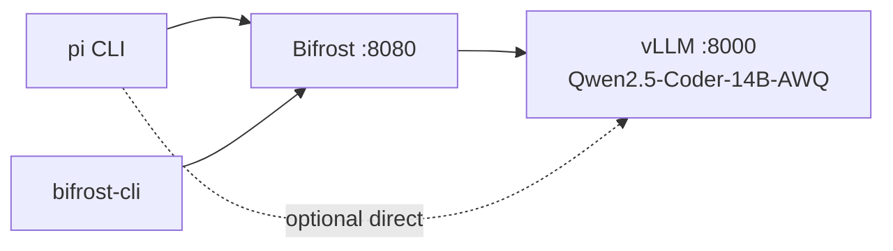

# Lab 09 — Consume the stack with Pi harness & Bifrost CLI

**Goal:** wire **Pi** (`pi` CLI) and **Bifrost CLI** to your vLLM endpoint — the same OpenAI API contract the blog uses for Claude Code.
**Prereqs:** vLLM running ([Lab 01](lab-01-vllm-single-gpu.md), [Lab 07](lab-07-jarvislabs-gpu.md), or [Lab 08](lab-08-modal-serverless.md)).

Full architecture diagrams: [`docs/architecture.md`](../architecture.md).

---

## What you're wiring



---

## Step 1 — vLLM up

Jarvis example (see [Lab 07](lab-07-jarvislabs-gpu.md)):

```bash
# on Jarvis VM
docker run -d --name vllm --gpus all -p 8000:8000 \
  vllm/vllm-openai:latest \
  --model Qwen/Qwen2.5-Coder-14B-Instruct-AWQ \
  --quantization awq_marlin \
  --served-model-name Qwen2.5-Coder-14B-AWQ \
  --gpu-memory-utilization 0.90 \
  --max-model-len 32768 \
  --max-num-seqs 4 \
  --enable-auto-tool-choice
```

Smoke test from Mac:

```bash
export VLLM_URL="http://<JARVIS_IP>:8000"
curl "$VLLM_URL/v1/models"
```

---

## Step 2 — Bifrost gateway

```bash
docker run -d --name bifrost -p 8080:8080 \
  -v "$(pwd)/bifrost-data:/app/data" maximhq/bifrost
```

Register vLLM (replace IP):

```bash
curl http://localhost:8080/api/providers \
  -H 'Content-Type: application/json' \
  -d '{
    "provider": "vllm-local",
    "keys": [{"name":"k1","value":"dummy","models":["*"],"weight":1.0}],
    "network_config": {"base_url":"http://<JARVIS_IP>:8000","default_request_timeout_in_seconds":120},
    "custom_provider_config": {"base_provider_type":"openai","allowed_requests":{"chat_completion":true,"chat_completion_stream":true}}
  }'
```

Test:

```bash
curl http://localhost:8080/v1/chat/completions \
  -H 'Content-Type: application/json' \
  -d '{
    "model": "vllm-local/Qwen2.5-Coder-14B-AWQ",
    "messages": [{"role":"user","content":"Say hi in 5 words."}]
  }'
```

Dashboard: `http://localhost:8080`

---

## Step 3 — Pi harness

### Install

```bash
npm install -g @earendil-works/pi-coding-agent
```

### Configure via Bifrost (recommended)

`~/.pi/agent/models.json`:

```json
{
  "providers": {
    "bifrost": {
      "baseUrl": "http://localhost:8080/v1",
      "api": "openai-completions",
      "apiKey": "none",
      "compat": {
        "supportsDeveloperRole": false,
        "supportsReasoningEffort": false
      },
      "models": [
        {
          "id": "vllm-local/Qwen2.5-Coder-14B-AWQ",
          "name": "Qwen Coder 14B (self-hosted)",
          "contextWindow": 32768,
          "maxTokens": 8192
        }
      ]
    }
  }
}
```

Run:

```bash
pi --model bifrost/vllm-local/Qwen2.5-Coder-14B-AWQ
```

Inside TUI: `/model` to switch · tools: Read, Write, Edit, Bash.

### Configure direct to vLLM (skip Bifrost)

```json
{
  "providers": {
    "vllm": {
      "baseUrl": "http://<JARVIS_IP>:8000/v1",
      "api": "openai-completions",
      "apiKey": "none",
      "compat": {
        "supportsDeveloperRole": false,
        "supportsReasoningEffort": false
      },
      "models": [
        { "id": "Qwen2.5-Coder-14B-AWQ", "contextWindow": 32768, "maxTokens": 8192 }
      ]
    }
  }
}
```

```bash
pi --model vllm/Qwen2.5-Coder-14B-AWQ
pi --list-models vllm
```

---

## Step 4 — Bifrost CLI

```bash
npx -y @maximhq/bifrost-cli
```

| Prompt | Value |
|--------|-------|
| Base URL | `http://localhost:8080` |
| Agent | Pi (or Claude Code / Codex) |
| Model | `vllm-local/Qwen2.5-Coder-14B-AWQ` |

CLI launches the agent with correct `OPENAI_BASE_URL` and model — no manual env vars.

---

## Troubleshooting

| Symptom | Fix |
|---------|-----|
| Pi: `No models available` | Invalid JSON in `models.json`; run `pi --list-models <provider>` |
| Pi: `developer` role error | Set `compat.supportsDeveloperRole: false` |
| Pi: `reasoning_effort` error | Set `compat.supportsReasoningEffort: false` |
| 404 model not found | Model `id` must match vLLM `--served-model-name` or `/v1/models` output |
| Bifrost can't reach vLLM | Use Jarvis **public IP**, not `localhost`, in provider `base_url` |
| Modal cold start 503 | Wait 1–3 min; retry health check |

---

## Cleanup

```bash
docker stop bifrost vllm && docker rm bifrost vllm   # local containers
# Jarvis: pause VM
```

**Back to:** [Architecture](../architecture.md) · [Lab 04 — Bifrost](lab-04-bifrost.md) · [README](../../README.md)
