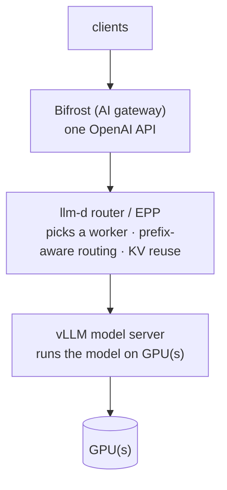

# Module 5 — Serving models with vLLM + llm-d

**Goal:** understand the serving layer — vLLM, llm-d, the router/EPP, prefix-aware routing, and the memory tuning that keeps it from OOM-ing.

## The layers



### vLLM — the engine

vLLM is the inference server. Key feature: **PagedAttention**, which manages the KV cache like virtual memory so it can pack many concurrent requests efficiently. You run it as `vllm serve <model> [flags]`.

### llm-d — the production wrapper

llm-d turns "a vLLM pod" into "a scalable, routable model service." Per model you deploy:

- a **model server** (kustomize overlay → the vLLM pods)
- a **router / EPP** (helm → the smart front for that model)
- (a gateway — *skipped* here because everything routes through Bifrost)

It uses **guides** (`optimized-baseline`) with a base + overrides via kustomize.

### Prefix-aware routing (the big win)

The router sends requests that **share a prompt prefix to the same worker**, so that worker's **KV cache is reused** instead of recomputed. For agentic/coding work — where a huge identical system prompt precedes every call — this is enormous. This is the capability the economics section (Module 7) calls "sliding-window prompt caching you own."

## The memory tuning that matters

A 27B model consumed **all 44 GB** of an L40S on first launch. Why? Two defaults:

- **KV-cache headroom** grows with context length.
- **`--max-num-seqs` defaults to 256** — vLLM pre-reserves memory for that many concurrent sequences.

The knobs:

| Flag | What it does |
|------|-------------|
| `--gpu-memory-utilization=0.95` | fraction of VRAM vLLM may use |
| `--max-model-len=128192` | max context window (128k here) |
| `--max-num-seqs=32` | max concurrent sequences (memory ↔ concurrency tradeoff) |
| `--tensor-parallel-size=N` | split model across N GPUs in the node |
| `--kv-cache-dtype=fp8_e4m3` | quantize the KV cache to save VRAM |
| `--speculative-config '{...}'` | MTP / speculative decoding for speed |

### The benchmark grind (how to tune)

MTP (multi-token prediction) predicts several tokens per step → big speedup, but costs memory, so `max-num-seqs` must drop.

| Config | max-num-seqs | tok/s |
|--------|-------------|-------|
| no MTP | 160 | 18.9 |
| MTP=3 | 16 | 43.8 |
| MTP=3 | **32** | **48.6 ✅** |
| MTP=3 | 40/50 | OOM ❌ |

**Method:** pick an MTP level → raise `max-num-seqs` until it OOMs → back off one step. Result: ~2.5× the naive throughput = 2.5× users per GPU = directly cheaper.

## Throughput vs. latency

On a fixed GPU you optimize for **one**:

- **Latency/perf** — fewer concurrent seqs, faster per-user. Scale users horizontally with more pods (KEDA).
- **Throughput** — more concurrent seqs, more total tokens/sec, slower per user.

The blog can fit the whole model on one card, so it tunes for **perf** and scales out with KEDA (Module 6).

## Where the model ends up

Once live, the model is a normal in-cluster URL:

```
http://<router>-epp.<namespace>.svc.cluster.local:80/v1
```

That's an OpenAI-compatible endpoint. Register it in Bifrost (or Envoy AI Gateway) and it's a routable production model.

## Local-track

You can run vLLM with a tiny model (`Qwen/Qwen2.5-0.5B-Instruct`) on CPU or a small GPU without the full llm-d machinery — see [lab-01](../labs/lab-01-vllm-single-gpu.md). Learn the vLLM flags first; add llm-d's router once the engine makes sense.

**Next:** [Module 6 — Scaling with KEDA](06-scaling-keda.md)
