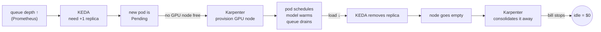

# Module 6 — Autoscaling with KEDA (chained into Karpenter)

**Goal:** understand why you scale on queue depth (not CPU%), and how KEDA + Karpenter chain into a hands-off system.

## Why not CPU%?

A vLLM pod pinned at 100% GPU can show near-zero CPU. Standard HPA (CPU/memory) is blind to how busy the model actually is. You must scale on a **serving signal** — how many requests are waiting.

## KEDA = event-driven autoscaling

KEDA extends HPA to scale on *external metrics* — here, a **Prometheus query**. The `ScaledObject` ties a Deployment to a trigger:

```yaml
triggers:
  - type: prometheus
    metricType: Value
    metadata:
      serverAddress: http://kube-prometheus-stack-prometheus.monitoring.svc:9090
      query: sum(llm_d_epp_average_queue_size{namespace="infra-qwen36"})
      threshold: "5"     # add a pod when avg queue/pod > 5
```

Read it as: *"keep average queue-per-pod around 5; if it's higher, add pods."*

## Pace it to reality

A cold vLLM pod takes ~5 minutes to load the model and warm up. Scaling faster than that just piles up `Pending` pods. So:

```yaml
scaleUp:
  policies: [{type: Pods, value: 1, periodSeconds: 300}]   # +1 pod / 5 min
scaleDown:
  policies: [{type: Pods, value: 1, periodSeconds: 600}]   # -1 pod / 10 min
```

Scale up cautiously (matches warmup), scale down even slower (avoid flapping when traffic is bursty).

## The elegant part: two autoscalers chained

KEDA and Karpenter **don't know about each other**. They chain through the scheduler:



- **KEDA** owns *"how many replicas?"* · **Karpenter** owns *"is there a node?"* · the **Pending pod** is the handoff.

- **KEDA** answers *"do I need more replicas?"*
- **Karpenter** answers *"is there a node for this pod?"*
- The **Pending pod** is the handoff between them.

Down the whole chain runs in reverse and you stop paying. Nobody touches a thing.

## The gotcha

If a NodePool's `limits` only allow one node, Karpenter can make only one node **even when KEDA asks for four**. Your `maxReplicaCount` must be backed by enough NodePool GPU limit:

```yaml
# KEDA
maxReplicaCount: 4
# Karpenter NodePool — must allow the GPUs those 4 pods need
limits: {cpu: 256, memory: 4096Gi, nvidia.com/gpu: 4}
```

## Local-track

`kind`/`minikube` have no Karpenter, but **KEDA works fine locally**. You can install KEDA, run a small vLLM Deployment, drive load, and watch replicas scale on a Prometheus metric. The pod-scaling half is fully learnable without a cloud bill — see [lab-05](../labs/lab-05-keda-autoscale.md).

**Next:** [Module 7 — Economics](07-economics.md)
