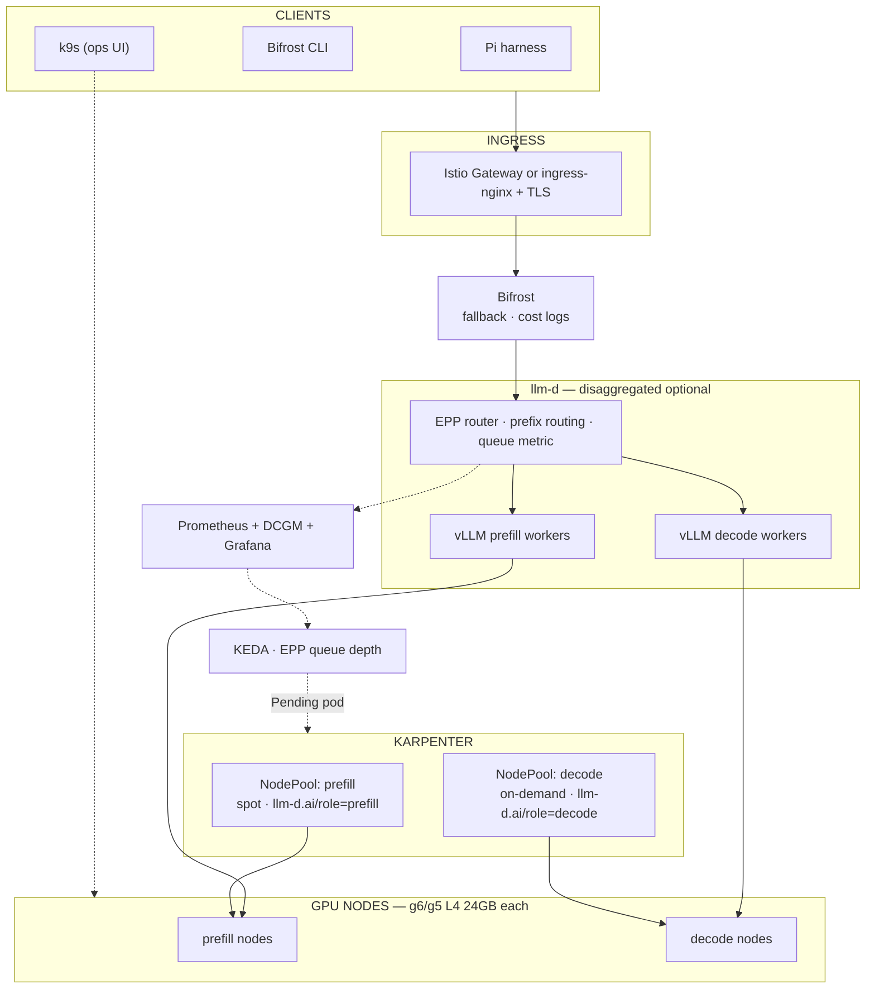
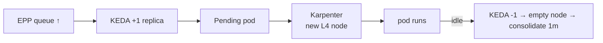

# Multi-GPU production stack — Karpenter, prefill + decode

Full blog architecture: **prefill pool (spot)** + **decode pool (on-demand)**, **Karpenter** JIT nodes, **KEDA** on queue depth, **llm-d**, **Bifrost**, observability — scaled for a **small team / solo power-user** on **L4-class GPUs** and **quantized coder models**.

> **kind + k9s:** use on Mac to learn scheduling ([Lab 00](labs/lab-00-local-cluster.md)). **Karpenter does not run on kind** — it needs a cloud API (AWS EC2). Multi-GPU + Karpenter = **EKS** (below) or cloud-equivalent.

---

## Architecture (same as blog)



### Autoscale chain (unchanged from blog)



---

## Two ways to run multi-GPU

| | **Path 1 — EKS + Karpenter** ⭐ | **Path 2 — Jarvis multi-VM (static nodes)** |
|--|--------------------------------|---------------------------------------------|
| Karpenter | ✅ real JIT EC2 nodes | ❌ — join VMs manually; pause = consolidate |
| Prefill/decode | ✅ same NodePools | ✅ same taints/labels |
| Spot prefill | ✅ AWS spot | ❌ all on-demand Jarvis |
| kind | ❌ use EKS | ❌ use **kubeadm** across VMs |
| k9s | ✅ against EKS kubeconfig | ✅ |
| Cost | AWS g6 ~$0.80/hr/L4 | Jarvis ~₹36/hr/L4 each |

**If you want Karpenter + prefill/decode as in the blog → Path 1 (EKS).**  
Path 2 keeps the **same pod/NodePool semantics** without auto-provisioning.

---

## Model (quantized, multi-GPU friendly)

| Role | Model | Pool | Notes |
|------|-------|------|-------|
| **Decode** (user-facing) | `Qwen/Qwen2.5-Coder-14B-Instruct-AWQ` | decode | `--max-num-seqs=8`, on-demand only |
| **Prefill** (batch prefix) | same or `Qwen/Qwen2.5-Coder-7B-Instruct-AWQ` | prefill | spot-tolerant; smaller = cheaper prefill |
| Stretch decode | `Qwen/Qwen2.5-Coder-32B-Instruct-AWQ` | decode | 1× L4, `--max-num-seqs=2` |

Blog uses Qwen3.6-27B-FP8 on L40S — you use **14B AWQ on L4** until you add A100/L40S nodes to the NodePool.

---

## Path 1 — EKS + Karpenter (real production)

Follow [blog.md](blog.md) + [Module 2](modules/02-karpenter-gpu-nodes.md). Substitute instance types and limits for **L4 scale**:

### NodePools (L4, small team limits)

Apply [`manifests/multi-gpu/karpenter-nodepools-l4.yaml`](../manifests/multi-gpu/karpenter-nodepools-l4.yaml):

```yaml
# Prefill — spot OK (retries on interrupt)
# g6.xlarge = 1× L4 24GB · ~$0.80/hr on-demand · spot ~60% off
requirements:
  - {key: node.kubernetes.io/instance-type, operator: In, values: ["g6.xlarge","g6.2xlarge","g5.xlarge","g5.2xlarge"]}
  - {key: karpenter.sh/capacity-type, operator: In, values: ["spot","on-demand"]}
taints: [{key: llm-d.ai/role, value: prefill, effect: NoSchedule}]
disruption: {consolidationPolicy: WhenEmptyOrUnderutilized, consolidateAfter: 1m}
limits: {nvidia.com/gpu: 4}   # cap spend — blog uses 8

# Decode — on-demand only
limits: {nvidia.com/gpu: 4}
taints: [{key: llm-d.ai/role, value: decode, effect: NoSchedule}]
```

### KEDA (multi-replica)

```yaml
minReplicaCount: 1
maxReplicaCount: 4          # match NodePool GPU limits
query: sum(llm_d_epp_average_queue_size{namespace="infra-coder"})
threshold: "5"
# scaleUp: +1 pod / 5min (vLLM cold start)
```

### llm-d deploy

- **Single pool first:** decode-only deployment ([homelab manifest](../manifests/homelab/vllm-coder-14b.yaml) flags on decode pool).
- **Disaggregated:** separate llm-d guides for prefill + decode workers ([Module 5](modules/05-serving-llm-d.md)); EPP routes prefill vs decode stages.

### Ops with k9s

```bash
aws eks update-kubeconfig --name genai-systems --region ap-south-1
k9s -n infra-coder          # :pods :node :events
k9s -n karpenter            # NodePools, NodeClaims
k9s -n monitoring           # Grafana port-forward
```

---

## Path 2 — Multi-GPU Jarvis (static nodes, no Karpenter)

Rent **2+ L4 VMs** (prefill + decode), build one cluster with **kubeadm** (not kind — kind doesn't span VMs).

### Topology

```text
VM1 (control-plane + optional decode)  ─┐
VM2 (prefill, spot if Jarvis offers)   ─┼─ kubeadm cluster
VM3 (decode, on-demand)                ─┘
```

### Join workers with blog labels/taints

On each GPU VM after `kubeadm join`:

```bash
# Prefill VM
kubectl label node prefill-1 llm-d.ai/role=prefill nvidia.com/gpu.present=true
kubectl taint node prefill-1 llm-d.ai/role=prefill:NoSchedule

# Decode VM
kubectl label node decode-1 llm-d.ai/role=decode nvidia.com/gpu.present=true
kubectl taint node decode-1 llm-d.ai/role=decode:NoSchedule
```

Pods use the **same** `nodeSelector` + `tolerations` as Karpenter NodePools — when you migrate to EKS, only the node provisioning layer changes.

### “Manual Karpenter”

| Blog (Karpenter) | Jarvis static |
|------------------|---------------|
| Pending pod → new EC2 | Scale replicas → need **you** to start another L4 VM + join |
| consolidateAfter 1m | **Pause** idle Jarvis VMs |
| spot prefill | cheaper Jarvis tier if available; else on-demand |

---

## Prefill vs decode — pod scheduling

**Decode deployment** (user tokens, must not interrupt):

```yaml
spec:
  template:
    spec:
      nodeSelector: {llm-d.ai/role: decode}
      tolerations: [{key: llm-d.ai/role, operator: Exists, effect: NoSchedule}]
      containers:
        - args:
            - "--max-num-seqs=8"
            - "--gpu-memory-utilization=0.90"
          resources:
            limits: {nvidia.com/gpu: 1}
```

**Prefill deployment** (spot-safe, can retry):

```yaml
spec:
  template:
    spec:
      nodeSelector: {llm-d.ai/role: prefill}
      tolerations: [{key: llm-d.ai/role, operator: Exists, effect: NoSchedule}]
      containers:
        - args:
            - "--max-num-seqs=16"    # prefill = throughput; interrupt OK on spot
          resources:
            limits: {nvidia.com/gpu: 1}
```

---

## Stack checklist (multi-GPU)

- [ ] Cluster: **EKS + Karpenter** (Path 1) or **kubeadm multi-VM** (Path 2)
- [ ] NVIDIA device plugin with `llm-d.ai/role` toleration
- [ ] NodePools **prefill** + **decode** (Karpenter YAML or static taints)
- [ ] GAIE CRDs + llm-d router + vLLM (prefill/decode overlays)
- [ ] Bifrost + fallback provider
- [ ] kube-prometheus-stack + DCGM (`release: kube-prometheus-stack` on monitors)
- [ ] KEDA ScaledObject on `llm_d_epp_average_queue_size`
- [ ] NodePool `limits.nvidia.com/gpu` ≥ KEDA `maxReplicaCount`
- [ ] Pi / Bifrost CLI → gateway ([Lab 09](labs/lab-09-consume-pi-bifrost-cli.md))
- [ ] k9s on kubeconfig for day-2 ops

---

## Learning path

| Step | Where | GPU |
|------|-------|-----|
| 1 | [Lab 00](labs/lab-00-local-cluster.md) kind + taints | CPU |
| 2 | [Lab 05](labs/lab-05-keda-autoscale.md) KEDA wiring | CPU |
| 3 | [homelab-production-stack.md](homelab-production-stack.md) single L4 | 1× L4 |
| 4 | **This doc** — prefill/decode + Karpenter | 2+ L4 / EKS |
| 5 | [blog.md](blog.md) full disaggregation + LMCache | team scale |

---

## Related manifests

| File | Purpose |
|------|---------|
| [karpenter-nodepools-l4.yaml](../manifests/multi-gpu/karpenter-nodepools-l4.yaml) | Prefill + decode NodePools for g6/g5 L4 |
| [keda-scaledobject-coder14b.yaml](../manifests/multi-gpu/keda-scaledobject-coder14b.yaml) | KEDA on EPP queue (max 4) |
| [vllm-coder-14b.yaml](../manifests/homelab/vllm-coder-14b.yaml) | Single-pool vLLM until llm-d split |
