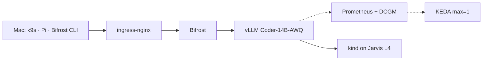

# Runbook — Single L4 production stack (Jarvis + kind + k9s)

**Goal:** production-shaped inference on **1× NVIDIA L4** — vLLM, Bifrost, KEDA, Prometheus, DCGM — for **Pi / Bifrost CLI** coding agents (PRs, diffs, templates).

**Time:** ~2–3 hr first run (model download dominates). **Cost:** ~₹36/hr — **pause Jarvis when done**.

| Item | Value |
|------|-------|
| GPU | Jarvis **L4** 24 GB, region **IN2** |
| Cluster | **kind** on the Jarvis VM |
| Ops UI | **k9s** on MacBook |
| Model | `Qwen/Qwen2.5-Coder-14B-Instruct-AWQ` |
| Karpenter | skip (add at multi-GPU / EKS — [multi-gpu doc](../multi-gpu-karpenter-stack.md)) |

---

## Prerequisites

**Jarvis VM:** 1× L4, Ubuntu 22.04 + CUDA, root SSH, Docker.

**MacBook:**

```bash
brew install kubectl helm k9s
```

**Repo on Jarvis VM:**

```bash
git clone https://github.com/atharvamhaske/llm-ineference.git
cd llm-ineference
export REPO_ROOT=$(pwd)
```

---

## Architecture



**Two deploy paths:**

| Path | When | Doc section |
|------|------|-------------|
| **A — Fast** | First boot; validate GPU + API | [Step 8A](#step-8a--vllm-fast-path) |
| **B — Full** | Add llm-d EPP router | [Step 8B](#step-8b--llm-d-full-path-optional) |

Do **Path A first**, then Bifrost + Pi. Add Path B when A is stable.

---

## Step 1 — Jarvis VM + GPU check

**On Jarvis (SSH):**

```bash
nvidia-smi
# Expect: NVIDIA L4, ~24 GB, driver loaded
```

✅ **Pass:** GPU name and memory shown.  
❌ **Fail:** `command not found` → pick CUDA image in Jarvis UI.

---

## Step 2 — Docker, kind, NVIDIA Container Toolkit

**On Jarvis:**

```bash
curl -fsSL https://get.docker.com | sh
sudo usermod -aG docker $USER
# log out/in or: newgrp docker

curl -Lo ./kind "https://kind.sigs.k8s.io/dl/v0.27.0/kind-linux-amd64"
chmod +x ./kind && sudo mv ./kind /usr/local/bin/kind

# kubectl — pick one:
sudo snap install kubectl --classic
# OR: https://kubernetes.io/docs/tasks/tools/install-kubectl-linux/

# NVIDIA Container Toolkit
curl -fsSL https://nvidia.github.io/libnvidia-container/gpgkey | \
  sudo gpg --dearmor -o /usr/share/keyrings/nvidia-container-toolkit-keyring.gpg
curl -s -L https://nvidia.github.io/libnvidia-container/stable/deb/nvidia-container-toolkit.list | \
  sed 's#deb https://#deb [signed-by=/usr/share/keyrings/nvidia-container-toolkit-keyring.gpg] https://#g' | \
  sudo tee /etc/apt/sources.list.d/nvidia-container-toolkit.list
sudo apt-get update && sudo apt-get install -y nvidia-container-toolkit
sudo nvidia-ctk runtime configure --runtime=docker
sudo systemctl restart docker
```

✅ **Pass:**

```bash
docker run --rm --gpus all nvidia/cuda:12.4.0-base-ubuntu22.04 nvidia-smi
```

---

## Step 3 — Create kind cluster (GPU worker)

**On Jarvis (`$REPO_ROOT`):**

```bash
kind create cluster --name inference --config manifests/homelab/kind-gpu.yaml
kubectl cluster-info --context kind-inference
kubectl get nodes -o wide
```

Taint the GPU worker (decode pool — blog NodePool equivalent):

```bash
WORKER=$(kubectl get nodes -l llm-d.ai/role=decode -o jsonpath='{.items[0].metadata.name}')
kubectl taint node "$WORKER" llm-d.ai/role=decode:NoSchedule --overwrite
```

✅ **Pass:** 2 nodes `Ready`; worker has label `llm-d.ai/role=decode`.

---

## Step 3b — One-command deploy with Tilt (recommended)

After Step 3, skip manual Steps 5–9 and run everything from the repo root:

```bash
# On Jarvis VM (install once)
curl -fsSL https://raw.githubusercontent.com/tilt-dev/tilt/master/scripts/install.sh | bash

cd $REPO_ROOT
tilt up
# Optional ingress on :80:
# tilt up -- --ingress=true
```

**What Tilt does:**

1. **`cluster-prep`** — removes control-plane `NoSchedule` taint so Prometheus/KEDA/Bifrost can schedule (fixes `FailedScheduling: untolerated taint control-plane` + `decode`).
2. **Helm** — nvdp, Prometheus, DCGM, KEDA, Bifrost (values in `tilt/values/`).
3. **Manifest** — `manifests/homelab/vllm-coder-14b.yaml` (vLLM + PodMonitor + ScaledObject).

Port-forwards in the Tilt UI: vLLM `:8000`, Bifrost `:8080`, Grafana `:3000`.

If a pod is still `Pending`, check it is not a chart default pod missing tolerations — re-run `tilt up` so `cluster-prep` completes first.

---

## Step 4 — kubeconfig on Mac + k9s

**On Jarvis:**

```bash
kind get kubeconfig --name inference > ~/kind-inference.kubeconfig
API_PORT=$(docker ps --filter name=inference-control-plane --format '{{.Ports}}' | grep -oP '0\.0\.0\.0:\K[0-9]+(?=->6443)')
echo "API port on host: $API_PORT"
```

**On Mac:**

```bash
scp root@<JARVIS_IP>:~/kind-inference.kubeconfig ~/.kube/kind-inference.yaml
# Edit server URL: 127.0.0.1 → <JARVIS_IP>, port → $API_PORT from above
export KUBECONFIG=~/.kube/kind-inference.yaml
kubectl get nodes

brew install k9s
k9s   # :nodes :pods :svc — q to quit
```

✅ **Pass:** `kubectl get nodes` works from Mac.

---

## Step 5 — NVIDIA device plugin

**On Jarvis or Mac (same kubeconfig):**

```bash
helm repo add nvdp https://nvidia.github.io/k8s-device-plugin
helm upgrade --install nvdp nvdp/nvidia-device-plugin \
  --namespace kube-system \
  --set tolerations[0].key=llm-d.ai/role \
  --set tolerations[0].operator=Exists \
  --set tolerations[0].effect=NoSchedule
```

Wait ~30s, then:

```bash
kubectl get nodes -o custom-columns=NAME:.metadata.name,GPU:.status.allocatable.nvidia\\.com/gpu
```

✅ **Pass:** GPU worker shows `1`.  
❌ **Fail:** `<none>` → device plugin not on tainted node; check tolerations.

**CUDA smoke test:**

```bash
kubectl apply -f - <<'EOF'
apiVersion: v1
kind: Pod
metadata: {name: cuda-test}
spec:
  restartPolicy: Never
  tolerations: [{key: llm-d.ai/role, operator: Exists, effect: NoSchedule}]
  nodeSelector: {llm-d.ai/role: decode}
  containers:
    - name: c
      image: nvidia/cuda:12.4.0-base-ubuntu22.04
      command: ["nvidia-smi"]
      resources: {limits: {nvidia.com/gpu: 1}}
EOF
kubectl wait --for=condition=Ready pod/cuda-test --timeout=120s 2>/dev/null || sleep 10
kubectl logs cuda-test
kubectl delete pod cuda-test
```

---

## Step 6 — Observability (Prometheus + DCGM)

```bash
helm repo add prometheus-community https://prometheus-community.github.io/helm-charts
helm upgrade --install kube-prometheus-stack prometheus-community/kube-prometheus-stack \
  -n monitoring --create-namespace \
  --set prometheus-node-exporter.enabled=false \
  --set nodeExporter.enabled=false \
  --wait

helm repo add gpu-helm-charts https://nvidia.github.io/dcgm-exporter/helm-charts
helm upgrade --install dcgm-exporter gpu-helm-charts/dcgm-exporter \
  -n monitoring \
  --set nodeSelector.nvidia\\.com/gpu\\.present=true \
  --set tolerations[0].key=llm-d.ai/role \
  --set tolerations[0].operator=Exists \
  --set tolerations[0].effect=NoSchedule \
  --set serviceMonitor.enabled=true \
  --set serviceMonitor.additionalLabels.release=kube-prometheus-stack
```

✅ **Pass:**

```bash
kubectl -n monitoring get pods | grep -E 'prometheus|dcgm'
# k9s -n monitoring
```

Grafana (optional):

```bash
kubectl -n monitoring port-forward svc/kube-prometheus-stack-grafana 3000:80
# http://localhost:3000 — admin / prom-operator
```

---

## Step 7 — KEDA

```bash
helm repo add kedacore https://kedacore.github.io/charts
helm upgrade --install keda kedacore/keda \
  -n keda --create-namespace --wait
kubectl -n keda get pods
```

✅ **Pass:** `keda-operator` Running.

---

## Step 8A — vLLM (fast path)

Deploy from repo manifest (includes Service, PodMonitor, ScaledObject):

```bash
kubectl apply -f manifests/homelab/vllm-coder-14b.yaml
```

Watch in k9s: `k9s -n infra-coder` → wait for `vllm-coder-14b` **Running** (5–15 min first time — HF download).

```bash
kubectl -n infra-coder rollout status deploy/vllm-coder-14b --timeout=900s
kubectl -n infra-coder logs -l app=vllm-coder-14b --tail=20
```

**Port-forward test (Mac):**

```bash
kubectl -n infra-coder port-forward svc/vllm-coder 8000:80 &
curl http://localhost:8000/v1/models
curl http://localhost:8000/v1/chat/completions \
  -H 'Content-Type: application/json' \
  -d '{
    "model": "Qwen2.5-Coder-14B-AWQ",
    "messages": [{"role":"user","content":"Write hello world in Go."}]
  }'
```

✅ **Pass:** JSON response with Go code.  
❌ **OOM:** see [Troubleshooting — OOM](#oom-on-vllm-startup).

**In-cluster URL for Bifrost:**

```
http://vllm-coder.infra-coder.svc.cluster.local
```

---

## Step 8B — llm-d (full path, optional)

Skip until Step 8A works.

```bash
kubectl apply -f https://github.com/kubernetes-sigs/gateway-api-inference-extension/releases/download/v1.5.0/v1-manifests.yaml

git clone https://github.com/llm-d-ai/llm-d.git ~/llm-d
cd ~/llm-d
# Add patch from docs/homelab-production-stack.md Phase 3
# helm install router + kubectl apply kustomize overlay
```

EPP URL (register in Bifrost instead of vLLM Service):

```
http://<router-release>-epp.infra-coder.svc.cluster.local:80/v1
```

Update KEDA query to `llm_d_epp_average_queue_size` — see [`manifests/multi-gpu/keda-scaledobject-coder14b.yaml`](../../manifests/multi-gpu/keda-scaledobject-coder14b.yaml).

---

## Step 9 — Bifrost gateway

```bash
kubectl create ns bifrost
kubectl create secret generic bifrost-encryption-key \
  --from-literal=encryption-key="$(openssl rand -base64 32)" -n bifrost

helm repo add bifrost https://maximhq.github.io/bifrost
helm upgrade --install bifrost bifrost/bifrost \
  -n bifrost \
  --set bifrost.encryptionKeySecret.name=bifrost-encryption-key \
  --set bifrost.encryptionKeySecret.key=encryption-key \
  --wait
```

**Register vLLM provider** (Path A — adjust base URL for Path B EPP):

```bash
kubectl -n bifrost port-forward svc/bifrost 8080:8080 &
# From Mac — Bifrost must reach in-cluster vLLM; run curl from a debug pod OR use host network:
kubectl run curl-test --rm -it --restart=Never --image=curlimages/curl -- \
  curl -s http://vllm-coder.infra-coder.svc.cluster.local/v1/models
```

Register via Bifrost UI `http://localhost:8080` or API:

```bash
curl http://localhost:8080/api/providers \
  -H 'Content-Type: application/json' \
  -d '{
    "provider": "vllm-homelab",
    "keys": [{"name":"k1","value":"dummy","models":["*"],"weight":1.0}],
    "network_config": {
      "base_url": "http://vllm-coder.infra-coder.svc.cluster.local",
      "default_request_timeout_in_seconds": 120
    },
    "custom_provider_config": {
      "base_provider_type": "openai",
      "allowed_requests": {"chat_completion": true, "chat_completion_stream": true}
    }
  }'
```

**Optional fallback** (VM paused / overflow): add Anthropic/OpenAI provider in UI with real API key.

Test:

```bash
curl http://localhost:8080/v1/chat/completions \
  -H 'Content-Type: application/json' \
  -d '{
    "model": "vllm-homelab/Qwen2.5-Coder-14B-AWQ",
    "messages": [{"role":"user","content":"Summarize what a PR template is in one sentence."}]
  }'
```

✅ **Pass:** response + request visible in Bifrost dashboard.

---

## Step 10 — Ingress (optional)

Expose Bifrost on port 80 (kind maps host 80 → control-plane):

```bash
helm repo add ingress-nginx https://kubernetes.github.io/ingress-nginx
helm upgrade --install ingress-nginx ingress-nginx/ingress-nginx \
  -n ingress-nginx --create-namespace --wait

kubectl apply -f - <<'EOF'
apiVersion: networking.k8s.io/v1
kind: Ingress
metadata: {name: bifrost, namespace: bifrost}
spec:
  ingressClassName: nginx
  rules:
    - http:
        paths:
          - path: /
            pathType: Prefix
            backend:
              service: {name: bifrost, port: {number: 8080}}
EOF
```

From Mac: `http://<JARVIS_IP>/v1/models` (via Bifrost routing).

**Simplest:** skip ingress; use `kubectl port-forward` or SSH tunnel.

---

## Step 11 — Pi harness + Bifrost CLI

Full detail: [Lab 09](../labs/lab-09-consume-pi-bifrost-cli.md).

**Pi** — `~/.pi/agent/models.json`:

```json
{
  "providers": {
    "homelab": {
      "baseUrl": "http://<JARVIS_IP>:8080/v1",
      "api": "openai-completions",
      "apiKey": "none",
      "compat": {
        "supportsDeveloperRole": false,
        "supportsReasoningEffort": false
      },
      "models": [
        {
          "id": "vllm-homelab/Qwen2.5-Coder-14B-AWQ",
          "name": "Homelab Coder 14B",
          "contextWindow": 32768,
          "maxTokens": 8192
        }
      ]
    }
  }
}
```

```bash
npm install -g @earendil-works/pi-coding-agent
pi --model homelab/vllm-homelab/Qwen2.5-Coder-14B-AWQ
```

**Example agent task:** “Read `git diff`, fill `.github/PULL_REQUEST_TEMPLATE.md`, run `gh pr create`.”

**Bifrost CLI:**

```bash
npx -y @maximhq/bifrost-cli
# Base URL: http://localhost:8080 (with port-forward) or http://<JARVIS_IP>:8080
```

---

## Step 12 — Verify KEDA wiring

ScaledObject is in `manifests/homelab/vllm-coder-14b.yaml`. Check:

```bash
kubectl -n infra-coder get scaledobject
kubectl -n infra-coder get hpa
```

With `maxReplicaCount: 1` it won't scale out — confirm Prometheus query returns data:

```bash
kubectl -n monitoring port-forward svc/kube-prometheus-stack-prometheus 9090:9090 &
# Browser: query vllm:num_requests_waiting
```

---

## Day-2 ops (k9s cheat sheet)

| Task | k9s |
|------|-----|
| Watch vLLM pod | `:pods -n infra-coder` |
| See GPU node | `:nodes` |
| Bifrost logs | `:pods -n bifrost` |
| KEDA events | `:hpa -n infra-coder` |
| Shell into vLLM | select pod → `s` |

| Task | Command |
|------|---------|
| **Stop billing** | Jarvis dashboard → **Pause** VM |
| Restart stack | Unpause VM → `kubectl get pods -A` |
| OOM fix | lower `--max-num-seqs` in manifest, re-apply |

---

## Troubleshooting

### OOM on vLLM startup

```bash
kubectl -n infra-coder logs -l app=vllm-coder-14b | tail -50
# Look for: CUDA out of memory
```

Fix — edit `manifests/homelab/vllm-coder-14b.yaml`:

```yaml
- "--max-num-seqs=2"           # was 4
- "--max-model-len=16384"      # was 32768
- "--gpu-memory-utilization=0.85"
```

```bash
kubectl apply -f manifests/homelab/vllm-coder-14b.yaml
kubectl -n infra-coder rollout restart deploy/vllm-coder-14b
```

### Pod Pending — no GPU

```bash
kubectl describe pod -n infra-coder -l app=vllm-coder-14b
```

Check: device plugin running, taint/toleration, `nvidia.com/gpu: 1` allocatable.

### Bifrost 502 to vLLM

Bifrost runs **inside** cluster — base URL must be **cluster DNS**, not `localhost:8000`:

```
http://vllm-coder.infra-coder.svc.cluster.local
```

### No Prometheus metrics / KEDA idle

PodMonitor needs `release: kube-prometheus-stack` (already in manifest).

### kind API unreachable from Mac

Fix kubeconfig `server:` to `<JARVIS_IP>:<mapped-port>` from `docker ps`.

---

## Teardown

```bash
# keep Jarvis disk — delete cluster only
kind delete cluster --name inference

# Jarvis dashboard → Pause or Delete instance
```

---

## What's next

| Stage | Doc |
|-------|-----|
| Multi-GPU + prefill/decode | [multi-gpu-karpenter-stack.md](../multi-gpu-karpenter-stack.md) |
| Karpenter (needs EKS) | [blog.md](../blog.md) §1 |
| Architecture diagrams | [architecture.md](../architecture.md) |

---

## Master checklist

- [ ] **Step 1** — `nvidia-smi` shows L4
- [ ] **Step 2** — Docker GPU test passes
- [ ] **Step 3** — kind cluster Ready, worker tainted
- [ ] **Step 4** — kubectl + k9s from Mac
- [ ] **Step 5** — `nvidia.com/gpu: 1`, cuda-test OK
- [ ] **Step 6** — Prometheus + DCGM Running
- [ ] **Step 7** — KEDA Running
- [ ] **Step 8A** — vLLM `/v1/models` OK
- [ ] **Step 9** — Bifrost routes to vLLM
- [ ] **Step 11** — Pi or Bifrost CLI completes a chat
- [ ] **Pause Jarvis VM**
